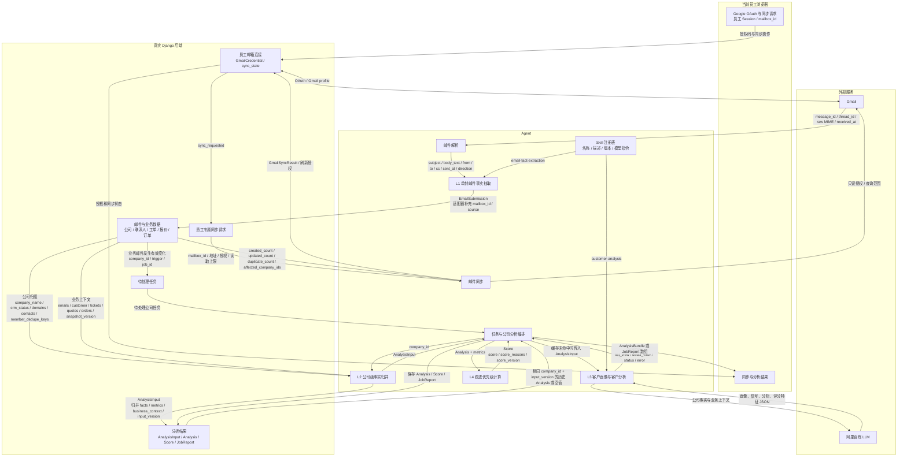

# SalesMate Agent MVP

更新日期：2026-09-12<br>
版本：v2.3<br>
状态：员工网页 Gmail 授权、一次性同步请求、L1–L4、Django HTTP 适配器和前端结果展示已经完成联调。

## 1. 当前范围

2026-09-13 软件集成更新：产品入口由 Django 独立 `crm_worker` 调度，支持原文/L1 输出持久缓存、完整历史分页补采、History 增量及人工补抽取。下文一次性 CLI 描述保留用于模块调试；已由 Worker 接管的邮箱不可再用旧 CLI 写游标。所有 `non_sales` 进入复核，来源变化自动失效并重算 L2–L4。当前产品运行与恢复边界见 [邮件处理适配](../backend/docs/processing-integration.md)。本轮验证使用模拟 Gmail/模型，不代表新增流程已完成真实外部联调。

本目录负责 Gmail 邮件理解和公司级销售分析：

```text
员工网页授权 Gmail
  → Django 保存员工邮箱连接并创建同步请求
  → Agent 一次性领取授权和同步范围
  → Gmail
  → L1 单封邮件事实抽取
  → DjangoBackendClient 提交真实后端
  → 后端保存、去重、归组并创建任务
  → L2 公司事实归并
  → L3 客户画像、客户分析和销售信号
  → L4 跟进优先级评分
  → DjangoBackendClient 保存到真实后端
```

Agent 不自行提供 HTTP 服务或数据库。现有 Django 后端负责员工会话、Google OAuth、邮箱凭证、公司、工单、报价、订单、任务和分析结果持久化；Agent 通过后端已经提供的 `/api/v1/agent/` HTTP 接口读取和写入。后端的服务认证、ETag 和任务租约由适配器处理，不进入 L1–L4 业务流程。

每个 Agent 服务凭证只绑定一名后端员工。共享 `crm_worker` 会为每个执行单元创建临时员工凭证并在结束后撤销；CLI 仍使用其配置的单员工凭证。Agent 领取的是这名员工从页面请求的邮箱同步任务，后端归组和页面查询也继续按员工隔离，因此前端表示“当前员工的 Gmail 收件箱”，不是整个公司的共享收件箱。

Agent 目录已经包含只读销售聊天的 Skill、模型适配、工作流、一次性 CLI 和离线测试，但不包含聊天 HTTP 服务、数据库、权威会话存储、知识库基础设施、业务工具执行器、常驻 Worker 或轮询循环。Gmail 发送、日历操作、CRM/文件写入及其他业务或外部数据创建、修改、删除均不在 Initial Release 能力范围内。页面筛选、排序、分页、CRM 建档和实际持久化仍由前后端负责。

### 1.1 只读销售聊天（Agent 侧已实现）

Agent Delivery 中已实现的聊天能力如下：

- `skills/sales-chat/SKILL.md` 通过现有 loader 提供独立 `sales-chat` Skill，版本为 `chat-v2`。它规定客户/内部来源优先、外部来源仅补缺、资料不足/部分支持/冲突/判断表达、精确 Citation 和提示注入隔离。
- `llm/bailian.py` 的 `generate_chat_json(messages, *, max_tokens)` 接收原序 `system|user|assistant` 消息并请求 JSON Object；请求不包含 `tools`、`tool_choice` 或函数调用字段。Existing L1–L4 Pipeline 继续使用原有 `generate_json()` 两消息接口。
- `workflows/chat.py` 严格解析请求、历史、上下文和模型候选；先读取 internal，再只在 `external_available=true` 时预取 external；按 customer → internal → external 裁剪，并把上下文、历史和当前问题包装为不可信数据。外部资料只能补足客户/内部证据没有支持的部分。
- 直接要求发送邮件、安排日历、写 CRM/文件等 Tool Action 时，工作流在读取客户或知识上下文前就在本地返回“未执行、当前仅支持问答”，不调用模型或业务工具。生成邮件文本、解释会议信息等无副作用文本请求仍属于只读问答。
- 可用资料为空时，本地返回资料不足和零引用；非空上下文完整交给模型结合当前问题与最近历史判断，不使用关键词规则提前丢弃同义表达。等价的简短资料不足措辞可以通过校验；事项指代不足时只返回一个简短澄清问题。其余请求至多调用模型一次，不自动修复或重试。
- 模型结果必须通过精确字段、Citation 三元组白名单与来源标识唯一性、marker、数值引用、受控语义关联、冲突声明和判断措辞校验。检索缺口只有与当前问题有关时才应进入回答；Agent 不再因为无关知识源失败而强制添加缺口说明，也不根据不同业务指标中的数字自动推断来源冲突。失败结果不包含未经验证的事实性回答。
- `process_chat_once()` 每次最多领取一个请求并尝试回报一次；无工作返回 `None`。回报失败只返回本地 `report_failed`，不会自动重试或声称已经保存。

Initial Release 的工具扩展点是关闭的：模型看不到工具 schema、回调或业务写接口，整个请求的 Tool Action 调用数为零。Agent 仍不是服务端，不监听 HTTP、不建数据库、不保存会话、不实现检索基础设施，也不自行持续领取请求。

### 1.2 一次性聊天 CLI

在项目根目录运行：

```powershell
python -m agent.main --process-chat-once
```

命令复用现有 `.env` 加载和 `DjangoBackendClient`：领取零个或一个聊天请求、生成稳定结果、尝试回报后立即退出。标准输出是 UTF-8 JSON；无工作或 `completed` 正常退出，`failed`（包括本地 `report_failed`）返回非零。该参数与 `--analysis-company-id`、`--process-jobs-once`、`--sync-authorized-mailboxes-once` 互斥。它不是 daemon；Demo 期间的重复触发必须由外部调度器或现有 Worker 串行完成。

### 1.3 三接口联调契约

`DjangoBackendClient` 已实现下列 Agent 侧 HTTP 映射，均复用既有 `Authorization: Agent <service-token>` 和 timeout，并对响应做最小契约校验：

| Agent 方法 | 受保护路径 | Agent 侧行为 |
|---|---|---|
| `claim_answer_request()` | `POST chat/requests/claim/` | 发送 `{}`；把 `{"request": null}` 规范为无工作，否则返回一条已绑定的请求 |
| `get_answer_context(request_id, scope)` | `POST chat/context/` | `scope` 仅允许 `internal|external`；独立校验客户上下文状态、知识状态、检索缺口和 external 可用性 |
| `report_answer(result)` | `POST chat/answers/` | 回报 `chat_prompt_version`、`completed|failed`、回答、Citation 和安全错误；接受后端首存或幂等重复响应 |

这些是 **Agent 适配器和 mocked contract**，不是“真实 Django 已经提供聊天接口”的声明。联调时，Backend Team 必须在现有 `/api/v1/agent/` 基址下实现并保护以上路径，按 service token 对员工、conversation、company、user message 和 request_id 做授权绑定；Agent 不发送任意 company/query 覆盖，也不得直连知识库。自动测试使用 fake session/backend，不连接真实 HTTP、模型、数据库或知识服务。

### 1.4 Agent Delivery 与 Web Demo Delivery

当前文档中的 **Agent Delivery** 仅指 `agent/` 内已有的 Chat Skill、有序模型边界、只读回答工作流、BackendClient 三接口映射、一次性 CLI，以及单元、示例、失败路径和四个确定性属性测试。它不等于网页可聊天 Demo 已交付。

以下仍是 **Web Demo Delivery 的外部阻塞依赖**：

1. **Backend Team**：实现 pending/processing/completed/failed answer request、原子 claim、员工与客户授权隔离、request_id 幂等 report、唯一 immutable assistant Message、Citation/安全错误持久化和浏览器可读状态投影。
2. **知识与上下文基础设施**：按当前 request 返回授权的最近客户邮件、最新有效 L3 画像、可用工单/报价/订单摘要、内部/外部知识，以及独立的 `customer_context_status`、`knowledge_status` 和安全 `retrieval_gaps`；Agent 当前只消费该契约，不检索或保存这些数据。
3. **Frontend Team**：提交 user Message 后显示生成中状态，以有界间隔轮询状态或会话历史，completed 时自动展示唯一 assistant Message 和 Citation，failed 时显示安全错误；切换客户/会话或关闭侧栏时取消旧轮询。
4. **Deployment/Backend Team**：Demo 运行期间由外部调度器或现有 Worker 串行、持续触发 `python -m agent.main --process-chat-once`。Agent 本身不会增加常驻循环。
5. **端到端验收**：只有“网页提问 → pending → Agent 领取 → 授权上下文/知识读取 → 一次模型回答 → 后端保存 → 网页自动显示回答与引用”通过，并且 Existing L1–L4 Pipeline 回归不变，才能声明 Web Demo Delivery 完成。

不要把 Agent 的 fake backend、mocked HTTP 测试或手工执行一次 CLI 当作真实后端持久化、浏览器自动刷新或持续运行能力。

### 1.5 聊天离线测试

```powershell
# 聊天工作流、CLI/百炼回归和三接口 mocked contract
python -m unittest agent.tests.test_chat agent.tests.test_core agent.tests.test_http_backend

# 包含 Existing L1–L4 Pipeline 回归的完整 Agent 离线套件
python -m unittest discover -s agent/tests -p "test_*.py"
```

`test_chat.py` 使用内存 fake backend 和 fake provider 覆盖消息顺序、空内容裁剪、提示注入、零 Tool Action、完整/部分/不足/冲突/判断回答、多轮同义提问、来源标识歧义、失败路径和一次回报，以及 Citation 精确匹配、资料不足、零工具动作和 request_id 幂等四个属性。测试不会发送仓库代码、客户数据或凭据到外部服务。真实 Backend/Frontend/Deployment 联调和网页端到端验收必须由对应团队另行执行。

## 2. 目录职责

```text
agent/
├── main.py                         # Gmail、L2、聊天和真实后端一次性任务 CLI
├── config.py                       # 从项目根目录 .env 读取共享配置
├── clients/
│   ├── __init__.py                 # 外部服务客户端包出口
│   └── backend_api.py              # BackendClient 协议、Django API 与聊天三接口映射
├── tools/
│   ├── gmail.py                    # 后端授权信息、Gmail History 与邮件读取
│   └── email_parser.py             # MIME、正文和历史回复解析
├── llm/
│   └── bailian.py                  # L1/L3 与有序聊天的百炼 JSON Object 请求
├── skills/
│   ├── loader.py                   # Skill 发现、元数据解析和进程内缓存
│   ├── email-fact-extraction/
│   │   └── SKILL.md                # L1 抽取指令、版本和输出上限
│   ├── customer-analysis/
│   │   └── SKILL.md                # L3 画像指令、版本和输出上限
│   └── sales-chat/
│       └── SKILL.md                # chat-v2 只读问答、grounding 与安全规则
├── workflows/
│   ├── l1_email.py                 # L1 单封邮件事实抽取
│   ├── gmail_sync.py               # 前端 Gmail 同步服务函数
│   ├── authorized_gmail_sync.py    # 领取并处理员工网页同步请求
│   ├── analysis_input.py           # L2 公司事实归并和指标
│   ├── customer_analysis.py        # L3 客户画像和分析
│   ├── lead_score.py               # L4 确定性优先级评分
│   ├── orchestration.py            # L2–L4 和一次任务处理
│   └── chat.py                     # 只读聊天验证、裁剪、回答和一次性编排
└── tests/
    ├── __init__.py                 # 测试包标记
    ├── email_submission_exploration.py  # L1 公共 fixture 与数据契约边界测试
    ├── fake_backend.py             # 仅供离线测试使用的协议假实现
    ├── test_chat.py                # 聊天示例、失败路径和四个属性测试
    ├── test_core.py                # L1、CLI、百炼客户端和数据契约单元测试
    ├── test_integration.py         # Gmail 只读读取、History 与百炼客户端集成测试
    ├── test_analysis_input.py      # L2 AnalysisInput 行为测试
    ├── test_http_backend.py        # Django HTTP 传输与聊天 mocked contract 测试
    └── test_mvp_pipeline.py        # Gmail 同步及 L2–L4 主链测试
```

没有单独的 `schemas` 或 `prompts` 层。模型能力以 `agent/skills/<skill-name>/SKILL.md` 组织，frontmatter 提供路由名称、用途描述、版本和输出 token 上限，正文保存模型指令。workflow 按名称加载 Skill，只负责拼装本次输入、调用百炼和校验结果。数据结构继续使用普通字典和少量就地 dataclass。

当前提供三个 Skill：

| Skill | 调用阶段 | 输入边界 | 产出 |
|---|---|---|---|
| `email-fact-extraction` | L1 | 一封解析后的邮件主题与当前正文 | 带原文证据的邮件事实 |
| `customer-analysis` | L3 | 一份公司级 `AnalysisInput` | 客户画像、分析、信号与评分特征 |
| `sales-chat` (`chat-v2`) | 只读聊天 | 当前问题、最近历史和本次授权上下文 | 经校验的自然语言回答与简单 Citation |

`agent.skills.list_skills()` 可返回可路由 Skill 的名称、描述、版本、指令与输出上限。修改 Skill 正文且会改变模型行为时必须同步递增其 `metadata.version`。未来邮件发送、会议排期或其他 Tool Action 必须经过独立规格、权限和确认设计；当前 `sales-chat` 不提供或预留可调用执行器。

QQ 邮箱已作为独立 IMAP 读取源追加，保留现有 Gmail 接入。`tools/qq_mail.py` 提供固定 QQ TLS 服务的只读适配，后端 `qq_sync` 持久同步并复用现有 L1–L4；无需 Google 回调域名。配置及协议兼容边界见 [QQ 邮箱试用](../backend/docs/qq-mailbox.md)。QQ 通过 `crm_worker` 运行，旧 Gmail CLI 不领取 QQ 任务。

## 2.1 模块交互流程图

总图只描述模块间的业务流程和数据流。模块内部的判断、校验和计算规则在后续章节分别说明。



### 各阶段交换的数据

| 阶段 | 数据方向 | 主要输入字段 | 主要输出字段 | 作用 |
|---:|---|---|---|---|
| 1. 员工邮箱授权 | 浏览器 ↔ Django ↔ Google | 员工 Session、OAuth code | mailbox_id、mailbox_address、授权状态、sync_requested | 绑定当前员工实际选择的 Gmail，不把令牌交给浏览器 |
| 2. 同步领取与邮件读取 | Django → Agent ↔ Gmail | mailbox_id、授权信息、读取上限 | message_id、thread_id、raw MIME、received_at | 一次性读取该员工最近的收件和发件邮件 |
| 3. 邮件解析 | Gmail → 邮件解析 → L1 | raw MIME 和 Gmail 元数据 | subject、body_text、from、to、cc、sent_at、direction | 把 Gmail resource 转成统一邮件结构 |
| 4. 单封事实抽取 | Skill → L1 → 后端 | `email-fact-extraction` 指令、统一邮件结构 | EmailSubmission：dedupe_key、contact_email、extract_status、facts | 最多四封并发抽取；一封异常不终止其他邮件 |
| 5. 保存与归组 | Agent → 后端 | 已完成的单封 EmailSubmission | 单封保存结果、company_id、公司成员邮件、必要的待处理任务 | 不等待最慢邮件，任一 L1 完成后立即逐封提交；独立事务避免一个冲突回滚整批邮件 |
| 6. 同步结果 | Agent → Django → 浏览器 | 后端保存结果 | fetched_count、l1_processed_count、created_count、duplicate_count、failed_extraction_count、failed_submission_count、email_errors、同步状态 | 邮箱阶段完成后立即回报；失败邮件保留到下一轮重试 |
| 7. 任务进入分析 | 后端 → 编排 | job_id、trigger、company_id | 本批次待分析公司列表 | 把邮件变化或业务数据变化转换为公司分析任务 |
| 8. 公司数据准备 | 后端 → L2 | 公司归组、邮件、客户、联系人、工单、报价、订单、快照版本 | 完整公司数据集合 | 为公司级事实归并提供统一上下文 |
| 9. 公司级事实归并 | L2 → 编排和后端 | 公司数据集合 | AnalysisInput：company、business_context、facts、metrics、input_version、unparsed_message_count | 形成 L3 唯一可信的分析输入 |
| 10. 分析缓存判断 | 后端 → 编排 | company_id、input_version | 已存在的 Analysis 或空值 | 相同数据版本不重复调用模型 |
| 11. 客户画像与分析 | Skill → L3 ↔ 百炼 | `customer-analysis` 指令、精简后的 AnalysisInput 推理视图 | Analysis：公司信号、工单信号、行业、规模、摘要、三维画像、四维分析、评分特征 | 完整 L2 继续用于校验和存储；百炼只接收分析所需字段，首次模型结果未通过业务规则时携带原因修正一次 |
| 12. 跟进优先级 | 编排 → L4 | Analysis、邮件指标 | Score：score、各特征贡献、说明和评分版本 | 计算 0–100 处理优先级；信息不足时返回 null |
| 13. 保存分析结果 | 编排 → 后端 | AnalysisInput、Analysis、Score、JobReport | 当前公司的最新分析状态 | 供真实后端以后持久化和提供给前端 |
| 14. 返回调用方 | 编排 → 后端 → 浏览器 | 完整分析结果 | AnalysisBundle、JobReport 与公司页面投影 | CLI 输出处理报告；前端通过后端读取结果 |

当前没有“前端上传 JSON 文件”或“后端返回磁盘文件”的过程。Agent workflow 内部交换普通字典，`DjangoBackendClient` 将这些字典转换成 HTTP JSON 请求和响应。前端页面查询、筛选、排序和分页继续调用 Django 的浏览器接口。

本地配置和测试注入器使用以下文件；网页 OAuth 凭证由 Django 保存：

| 本地文件 | 读取者 | 用途 | 是否与前端或后端交换 |
|---|---|---|---|
| `.env` | Django、Agent 和百炼客户端 | 后端、模型与 Agent API 的共享本地配置 | 否 |
| `test_tools/gmail_inject_credentials.json` | `test_tools/gmail_test_injector.py` | 测试邮件注入器专用 Desktop OAuth 配置 | 否 |
| `test_tools/gmail_inject_token.json` | `test_tools/gmail_test_injector.py` | 测试邮件注入器专用 OAuth token 缓存 | 否 |

`agent/tests/fake_backend.py` 只用于不连接网络和数据库的自动测试，不参与 CLI 或实际部署。运行时数据全部由 Django 后端持久化。

## 3. L1：邮件事实抽取

入口：

```python
process_email(email, mailbox_address, extraction_provider) -> EmailSubmission
```

处理顺序：

1. Gmail 工具读取 raw 邮件。
2. `email_parser.py` 解析 MIME、主题、正文、地址和时间。
3. 根据 `from` 与授权邮箱判断入站或出站。
4. 选择主要外部联系人。
5. 自动邮件、营销邮件和 no-reply 邮件跳过 LLM。
6. 业务邮件调用百炼抽取事实。
7. 校验证据确实能在当前主题或正文中定位；默认百炼结果若仅因 JSON 结构或证据校验失败，会携带校验原因立即重试一次。

`EmailSubmission` 主要字段：

```json
{
  "dedupe_key": "sales@example.com:gmail-message-id",
  "mailbox_address": "sales@example.com",
  "gmail_message_id": "gmail-message-id",
  "thread_id": "thread-id",
  "from": "buyer@example.com",
  "to": ["sales@example.com"],
  "cc": [],
  "sent_at": "2026-09-12T10:00:00+08:00",
  "received_at": "2026-09-12T02:00:00+00:00",
  "subject": "采购咨询",
  "body_text": "需要 50 台检测设备，请提供报价。",
  "direction": "inbound",
  "contact_email": "buyer@example.com",
  "non_business_hint": false,
  "non_business_reason": null,
  "extract_status": "completed",
  "extract_prompt_version": "extract-v6",
  "extract_error": null,
  "facts": {}
}
```

`facts` 固定包含 17 个字段：

- `has_substantive_update`
- `message_summary`
- `intent_hint`
- `intent_evidences`
- `contact_name`
- `contact_title`
- `company_self_reported`
- `business_background`
- `employee_scale_hint`
- `product_need`
- `quantity`
- `budget`
- `delivery_time`
- `decision_process`
- `concerns`
- `quote_reference`
- `order_reference`

13 个普通事实字段都是：

```json
[
  {
    "value": "50 台",
    "evidences": ["需要 50 台检测设备"]
  }
]
```

未知事实返回空数组。一项事实可以有多个 value，每个 value 可以有多条证据。项目不再使用 `requirements` 字段。

## 4. Gmail 同步接口

正式页面链路由员工在 Django 页面完成 OAuth；后端随后自动启动 Agent。以下命令保留为关闭自动运行后的手工调试入口：

```powershell
python -m agent.main --sync-authorized-mailboxes-once
```

自动执行和该调试命令都通过 `claim_mailbox_syncs()` 取得邮箱地址、后端保存的授权信息和读取上限；Agent 必要时刷新授权，完成同步后调用 `report_mailbox_sync()`。浏览器只读取同步状态并轮询结果。

`sync_gmail()` 是底层同步函数。直接调用时需要后端提供的授权信息和 mailbox_id；正常产品流程由 `sync_authorized_mailboxes_once()` 从后端领取这些数据：

```python
from agent.clients.backend_api import DjangoBackendClient
from agent.workflows.gmail_sync import sync_gmail

backend = DjangoBackendClient(
    "http://127.0.0.1:8000/api/v1/agent/",
    "agent-service-token",
    mailbox_id="后端邮箱 UUID",
)
result = sync_gmail(
    {
        "mailbox_id": "mb1",
        "access_token": "direct-access-token",
        "mailbox_address": "sales@example.com",
        "max_results": 20,
    },
    backend=backend,
)
```

`mailbox_address` 可以省略，此时读取 Gmail profile。`max_results` 必须是 1–20。首次同步读取最近的收件和发件邮件，并在本轮逐封提交结束后通过后端现有 `sync-state` 接口保存 Gmail `historyId`。读取邮件后，Agent 先按 `dedupe_key` 查询后端已有记录：当前 `extract-v6` 已完成或已确认为非业务的邮件直接复用，不再次调用百炼；失败记录继续抽取；不存在的邮件执行正常 L1。需要执行 L1 的邮件使用最多四个线程并发处理；任一邮件完成后立即在主线程逐封调用后端接口，不等待同批最慢的模型调用。默认百炼输出若只是不符合 L1 JSON 或原文证据约束，会在当前线程内修正重试一次；网络、配置和第二次校验失败仍作为单封失败隔离。提交顺序因此是 L1 实际完成顺序，最终统计仍与邮件顺序无关。一封邮件的处理或提交错误不会回滚其他邮件。同版本失败记录再次抽取仍失败时保留后端原记录，不提交后端禁止的 `failed → failed` 改写。所有未完成的 message ID 保存在 `scope.failed_message_ids`，下一次同步继续读取和处理。后续同步只读取游标之后新增的邮件；历史游标过期时退回最近邮件扫描，最终仍由 `dedupe_key` 保证保存幂等。

如果传入的测试后端或旧适配器没有 `get_sync_state()` 与 `save_sync_state()`，`sync_gmail()` 会兼容退回原来的最近邮件扫描。游标读取或保存不可用不会改变邮件提交的正确性，只会让下一次同步重新扫描最近邮件。

L1 的标准 `EmailSubmission` 保持上一节的业务字段。HTTP 适配器提交时额外加入后端传输所需的 `mailbox_id` 和 `source=gmail_real`，但不会把多值 facts 降级成后端当前的旧单值结构。

成功结果：

```json
{
  "mailbox_id": "mb1",
  "status": "completed",
  "sync_mode": "incremental",
  "cursor_saved": true,
  "fetched_count": 5,
  "pending_message_count": 0,
  "retry_message_count": 0,
  "failed_email_count": 0,
  "l1_processed_count": 2,
  "skipped_existing_count": 3,
  "created_count": 1,
  "updated_count": 1,
  "duplicate_count": 3,
  "failed_extraction_count": 0,
  "failed_submission_count": 0,
  "email_errors": [],
  "affected_company_ids": ["company-1", "company-2"],
  "job_reports": [],
  "error": null
}
```

底层同步函数只负责 Gmail、L1 和逐封邮件提交。产品入口由独立 `crm_worker` 并行调度同步与公司画像，逐封完成即保存，前端分别读取批次进度和当前客户结果。保留的 Gmail CLI 仍先完成同步再处理公司 Job，仅用于单独调试，不与新 Worker 混用同一邮箱。`job_reports` 在调用 `process_jobs_once()` 后由调用方填入。

后端需要遵循的提交规则：

- 相同 `dedupe_key` 不重复保存。
- 原记录为 `failed`、新结果为 `completed` 时更新事实。
- 企业邮箱按域名归组。
- 常见公共邮箱按完整联系人邮箱归组。
- 新公司默认未建 CRM 档案。
- 只有业务邮件且 `has_substantive_update=true` 时创建分析任务。

## 5. L2：AnalysisInput

入口：

```python
build_analysis_input(
    company_id,
    backend=backend,
    merge_version="merge-v2",
    clock=clock,
) -> AnalysisInput | ValidationError
```

L2 不调用 LLM。它从后端读取 `Grouping` 和 `CompanyContext`，完成：

- 多封邮件事实无损归并
- 为每条事实补充 `dedupe_key` 和 `fact_time`
- 计算收发数量、有效入站数量和最近响应间隔
- 统计未解析邮件
- 携带联系人、客户、工单、报价和订单上下文
- 计算可用于缓存的 `input_version`

输出结构：

```json
{
  "company_id": "company:example.com",
  "input_version": "sha256:...",
  "merge_version": "merge-v2",
  "external_snapshot_version": "ext-3",
  "built_at": "2026-09-12T10:01:00+08:00",
  "company": {
    "company_name": "Example",
    "crm_status": "unregistered",
    "domains": ["example.com"],
    "contacts": []
  },
  "business_context": {
    "customer": {},
    "tickets": [],
    "quotes": [],
    "orders": []
  },
  "latest_message_summary": "客户要求提供正式报价",
  "member_dedupe_keys": [],
  "unparsed_message_count": 0,
  "facts": {},
  "metrics": {}
}
```

`input_version` 由邮件的 `dedupe_key`、抽取版本、抽取状态、`merge_version` 和后端 `external_snapshot_version` 计算。业务数据变化时，真实后端必须同步更新 `external_snapshot_version`。

后端业务上下文使用以下最小对象格式：

```json
{
  "contact": {
    "contact_email": "buyer@example.com",
    "contact_name": "王宇",
    "interaction_count": 3,
    "is_primary": true
  },
  "customer": {
    "customer_id": "customer-1",
    "industry_from_crm": "工业自动化",
    "employee_count": 260,
    "employee_count_source": "crm",
    "first_deal_at": "2025-06-01T08:30:00+08:00"
  },
  "ticket": {
    "ticket_id": "ticket-1",
    "name": "设备采购跟进",
    "stage": "需求沟通",
    "amount": null,
    "currency": "CNY",
    "owner": "Demo Sales"
  },
  "quote": {
    "quote_id": "quote-1",
    "ticket_id": "ticket-1",
    "sent_at": "2026-09-10T11:00:00+08:00",
    "amount": 280000,
    "currency": "CNY",
    "status": "sent",
    "evidence_type": "actual_outbound"
  },
  "order": {
    "order_id": "order-1",
    "closed_at": "2025-06-01T08:30:00+08:00",
    "amount": 450000,
    "currency": "CNY",
    "products": ["工业传感器"],
    "source_system": "erp"
  }
}
```

## 6. L3：客户画像和客户分析

入口：

```python
generate_analysis(
    analysis_input,
    analysis_provider=bailian_analysis_provider,
    clock=clock,
) -> dict
```

L3 一次百炼调用同时生成页面 A 和页面 B 所需的 Agent 字段。调用前会从完整 `AnalysisInput` 构造精简推理视图：保留公司、业务上下文、事实值、事实时间、来源、指标和分析基准时间，删除仅用于缓存的版本字段、重复成员列表以及 L1 已验证过的原文证据副本。完整 L2 仍用于结果校验和后端保存。

`list_view` 包含公司主信号和证据、逐工单信号、行业、规模档位、最新摘要，以及三个 0–3 或 `null` 的评分特征。

主信号枚举：

- `repeat_purchase`
- `quoted_not_closed`
- `inquiry_intent`
- `new_lead_no_profile`
- `unknown`

信号证据门槛：

- `quoted_not_closed` 必须有 `evidence_type=actual_outbound` 的报价。
- `repeat_purchase` 必须同时有历史订单和本次新采购动作。
- `inquiry_intent` 必须有明确产品、数量、预算或交期事实。
- `new_lead_no_profile` 必须是未建档且只有一次入站的新线索。
- 证据不足返回 `unknown`。

`detail_view.profile` 包含 `industry_context`、`company_ops`、`intent`；`detail_view.analysis` 包含 `timeline`、`opportunity`、`risk`、`guidance`。

七个维度统一使用：

```json
{
  "facts": [{"text": "...", "source_refs": ["来源ID"]}],
  "inferences": [
    {
      "text": "...",
      "basis": "...",
      "confidence": "high",
      "source_refs": ["来源ID"]
    }
  ],
  "missing_fields": []
}
```

允许的 `source_refs`：邮件 `dedupe_key`、`company_id`、`customer_id`、联系人邮箱、`ticket_id`、`quote_id` 和 `order_id`。调用百炼时会额外列出本次输入可用的完整来源字符串，模型必须原样复制；若模型只多加了 `company_id:` 等已知类型前缀，并且去掉前缀后能精确命中输入来源，Agent 会安全规范为原始 ID。重复来源会在本地去重，`metrics`、`facts` 等字段名仍不是合法来源。

L3 会拒绝无效来源、无来源的事实或推断、非法枚举、成交概率、错误规模档位、不满足门槛的信号，以及有未解析邮件却没有完整度说明的结果。单层 JSON Markdown 代码围栏和重复来源由本地规范化，不触发第二次模型调用；其他 JSON 或业务规则失败时，Agent 才会将具体校验原因和合法来源列表交给模型完整修正一次。第二次仍不合法才返回失败。邮件原文中的付款比例、良率等业务百分比允许按原文引用，不会被误判为成交概率。`repeat_purchase` 的历史订单只能来自 `business_context.orders`；邮件自述和 `facts.order_reference` 不能代替后端订单记录。`size_band` 和 `size_source` 最终由后端客户档案中的 `employee_count` 与 `employee_count_source` 确定；人数未知时固定输出 `unknown`，不接受模型猜测。冲突字段只允许使用 L1 的十三个事实字段，模型偶发返回的 `company_name` 会规范为 `company_self_reported`，其他非法字段在提交后端前失败。

失败时返回 `status=failed`、`list_view=null`、`detail_view=null` 和本地调试错误，不写入分析缓存。

成功的 `Analysis` 示例：

```json
{
  "company_id": "company:example.com",
  "input_version": "sha256:...",
  "analysis_prompt_version": "analysis-v3",
  "generated_at": "2026-09-12T10:02:00+08:00",
  "analysis_base_time": "2026-09-12T10:01:00+08:00",
  "status": "completed",
  "list_view": {
    "signal": "repeat_purchase",
    "signal_evidence": {
      "text": "历史订单客户再次提出明确采购需求",
      "source_refs": ["order-1", "sales@example.com:gmail-message-id"]
    },
    "ticket_signals": [
      {
        "ticket_id": "ticket-1",
        "signal": "repeat_purchase",
        "reason": "存在历史订单和本次新采购动作"
      }
    ],
    "industry": "工业检测",
    "industry_evidence": {
      "text": "CRM 行业和邮件产品需求指向工业检测",
      "source_refs": ["customer-1", "sales@example.com:gmail-message-id"]
    },
    "size_band": "200_500",
    "size_source": "crm",
    "headline_summary": "客户要求在截止日前取得正式报价",
    "score_features": {
      "demand_clarity": {"value": 3, "basis": "产品、数量和报价要求明确"},
      "urgency": {"value": 3, "basis": "存在明确回复截止日"},
      "decision_visibility": {"value": 2, "basis": "已知项目负责人和内部汇报安排"}
    }
  },
  "detail_view": {
    "conflicts": [],
    "profile": {
      "industry_context": {
        "facts": [{"text": "CRM 行业为工业自动化", "source_refs": ["customer-1"]}],
        "inferences": [],
        "missing_fields": []
      },
      "company_ops": {
        "facts": [{"text": "公司员工数为 260", "source_refs": ["customer-1"]}],
        "inferences": [],
        "missing_fields": []
      },
      "intent": {
        "facts": [{"text": "客户要求正式报价", "source_refs": ["sales@example.com:gmail-message-id"]}],
        "inferences": [],
        "missing_fields": []
      }
    },
    "analysis": {
      "timeline": {
        "facts": [{"text": "客户再次发起采购咨询", "source_refs": ["sales@example.com:gmail-message-id"]}],
        "inferences": [],
        "missing_fields": []
      },
      "opportunity": {
        "facts": [{"text": "客户有一笔历史订单", "source_refs": ["order-1"]}],
        "inferences": [{"text": "存在复购机会", "basis": "历史订单加本次新采购动作", "confidence": "high", "source_refs": ["order-1", "sales@example.com:gmail-message-id"]}],
        "missing_fields": []
      },
      "risk": {
        "facts": [],
        "inferences": [],
        "missing_fields": ["最终审批人"]
      },
      "guidance": {
        "facts": [],
        "inferences": [{"text": "优先确认最终审批人", "basis": "当前决策链信息不完整", "confidence": "medium", "source_refs": ["ticket-1"]}],
        "missing_fields": []
      }
    },
    "missing_fields": ["最终审批人"],
    "context_completeness": {
      "unparsed_message_count": 0,
      "note": null
    }
  },
  "error": null
}
```

## 7. L4：跟进优先级

入口：

```python
compute_score(analysis, analysis_input, clock=clock) -> dict
```

分数表示销售处理优先级，不是成交概率。

| 特征 | 权重 |
|---|---:|
| signal | 0.30 |
| demand_clarity | 0.20 |
| urgency | 0.20 |
| decision_visibility | 0.10 |
| recency | 0.15 |
| substantive_inbound_count | 0.05 |

信号归一值：`repeat_purchase=1.00`、`quoted_not_closed=0.80`、`inquiry_intent=0.65`、`new_lead_no_profile=0.35`。

三个模型特征除以 3；最近入站按 30 天线性衰减；有效入站数量按最多 5 封归一化。各项贡献四舍五入为整数，最终分数等于贡献之和。

信号为 `unknown`、任一模型特征为 `null`，或没有最近入站时间时，`score=null`，原因只有 `insufficient_data`。

成功的 `Score` 示例：

```json
{
  "company_id": "company:example.com",
  "input_version": "sha256:...",
  "score": 88,
  "score_reasons": [
    {"feature": "signal", "contribution": 30, "note": "历史订单客户再次采购"},
    {"feature": "demand_clarity", "contribution": 20, "note": "产品、数量和报价要求明确"},
    {"feature": "urgency", "contribution": 20, "note": "存在明确回复截止日"},
    {"feature": "decision_visibility", "contribution": 7, "note": "已知项目负责人和内部汇报安排"},
    {"feature": "recency", "contribution": 10, "note": "最近有效来信距今 10.0 天"},
    {"feature": "substantive_inbound_count", "contribution": 1, "note": "有效入站邮件 1 封"}
  ],
  "score_version": "score-v1",
  "scored_at": "2026-09-12T10:02:00+08:00"
}
```

## 8. 编排和后端接口

完整公司分析：

```python
analyze_company(
    company_id,
    backend=backend,
    analysis_provider=bailian_analysis_provider,
    clock=clock,
) -> AnalysisBundle
```

执行顺序：构建并保存 L2；查询 L3 缓存；未命中时调用百炼；只保存校验成功的 L3；计算并保存 L4；返回 L2、L3、L4、缓存状态和错误。

一次任务处理：

```python
process_jobs_once(
    backend=backend,
    limit=10,
    analysis_provider=bailian_analysis_provider,
    clock=clock,
) -> list[JobReport]
```

支持 `email_ingested`、`customer_detail_opened`、`external_updated` 和 `grouping_changed`。函数领取一批任务后立即返回；同一批中相同公司只分析一次。Agent workflow 不实现常驻轮询或任务级自动重试；L1 和 L3 各自的一次模型校验修正不属于任务重试。现有 Django 后端要求的租约和版本请求头由 `DjangoBackendClient` 管理。

Agent workflow 依赖 `agent.clients.backend_api.BackendClient`：

```python
submit_emails(submissions)
get_company_grouping(company_id)
get_company_context(company_id)
save_analysis_input(analysis_input)
get_latest_analysis_input(company_id)
get_cached_analysis(company_id, input_version)
save_analysis(analysis)
save_score(score)
claim_jobs(limit)
report_job(report)
claim_mailbox_syncs(limit)
report_mailbox_sync(report)
```

`agent.clients.backend_api.DjangoBackendClient` 已针对当前 Django API 做以下传输适配：

- 使用 `Authorization: Agent <service-token>`。
- 为邮件提交补充 `mailbox_id` 和 `source=gmail_real`。
- 最多四路并发执行 L1，并把后端逐封邮件结果聚合为同步统计。
- 单封查询、L1 或提交失败只记录到 `email_errors` 和重试 ID，不使其他邮件回滚。
- 保存并传递 Grouping/CompanyContext 的 ETag。
- 读取后端 Job 的顶层 `company_id`。
- 内部保存 `lease_token` 和 `expected_version`，写入 L2/L3/L4 时自动添加请求头。
- 缓存未命中映射为 `None`；命中时要求后端返回完整 Analysis。
- 领取当前服务凭证所属员工的 Gmail 同步请求，并回报同步状态和刷新后的授权。
- 通过现有 `sync-state` 端点读取和保存 Gmail `historyId`，后续同步在 L1 之前跳过未变化的历史邮件。
- 通过现有单封邮件兼容查询识别同版本完成记录，首次建立游标时也不会用新的模型结果覆盖已有事实。

适配器不会改变 `extract-v6` 多值事实和 L2、L3、L4 字段层级。当前 Django 后端已经按这些结构完成对齐。

## 9. 运行

在项目根目录安装依赖：

```powershell
python -m pip install -r requirements.txt
```

项目根目录 `.env` 至少包含：

```text
DASHSCOPE_API_KEY=...
BAILIAN_BASE_URL=https://dashscope.aliyuncs.com/compatible-mode/v1
BAILIAN_MODEL=模型名称
SALESMATE_BACKEND_AGENT_URL=http://127.0.0.1:8000/api/v1/agent/
SALESMATE_AGENT_SERVICE_TOKEN=后端生成的Agent服务令牌
SALESMATE_MAILBOX_ID=后端创建的邮箱UUID
SALESMATE_JOB_LEASE_SECONDS=120
SALESMATE_BACKEND_TIMEOUT=30
```

网页 Gmail OAuth 的 `GOOGLE_OAUTH_CLIENT_ID`、`GOOGLE_OAUTH_CLIENT_SECRET` 和回调地址由 Django 从同一个根 `.env` 读取，Agent 无需重复配置。

```powershell
# 从真实后端读取公司数据，只构建并输出 L2
python -m agent.main --analysis-company-id <COMPANY_UUID>

# 从真实后端领取一批任务，运行一次 L2-L4 后立即退出
python -m agent.main --process-jobs-once --job-limit 10

# 领取员工在网页请求的 Gmail 同步，并运行本次 L1-L4
python -m agent.main --sync-authorized-mailboxes-once

# 领取并回答至多一条聊天请求，然后立即退出
python -m agent.main --process-chat-once
```

`--process-chat-once` 是只读聊天的一次性 Agent 客户端入口，依次使用受保护的 claim/context/report 接口；它不启动 HTTP 服务、数据库、常驻循环或工具执行器。后端的回答请求、授权上下文、assistant/Citation 持久化和浏览器状态投影，以及持续触发该一次性命令的运行器，仍是 Web Demo 的外部依赖。

网页授权通过 Django 建立员工邮箱连接；浏览器不接触 token，Django 按需启动的 Agent 或 `--sync-authorized-mailboxes-once` 调试命令从受保护的 Agent API 领取。旧的 `--message-id`、`--recent` 和 `--sync-gmail` 本机 Desktop OAuth 命令已经删除，避免与正式网页授权流程维护两套凭据。

### 9.1 向测试 Gmail 注入全链路样例

没有多个真实外部联系人邮箱时，可以使用独立测试工具把六封 RFC 2822 合成邮件直接插入开发者自己的 Gmail。该工具不调用或修改后端，也不会向外部地址发送邮件；网页仍通过原有只读 OAuth 拉取，所以邮件会经过 Gmail、L1、后端归组和 L2–L4。Gmail 官方 `messages.insert` 会绕过大部分正常投递扫描，因此该流程不验证 SMTP、SPF、DKIM 或垃圾邮件分类。

测试邮件注入器位于与 `agent/`、`backend/` 同级的 `test_tools/`，可由开发和测试人员独立使用。完整准备步骤、权限说明、全流程验证和清理方法见 [测试工具说明](../test_tools/README.md)。在 Google Cloud 的 Credentials 页面另外创建一个 **Desktop app** OAuth Client，将下载的 JSON 重命名为 `gmail_inject_credentials.json` 并放入 `test_tools/`。不要使用后端网页授权所需的 Web application Client；它只允许登记的 Django 回调地址，不能接收测试注入器生成的随机 localhost 端口。在 OAuth consent screen 中还要把测试 Gmail 加入 Test users。预览本次样例：

```powershell
python -m test_tools.gmail_test_injector --dry-run
```

实际插入：

```powershell
python -m test_tools.gmail_test_injector
```

工具默认读取 `test_tools/gmail_test_messages.template.json`，也可通过 `--messages-file` 指定测试人员自己的 JSON；收件箱由 JSON 顶层的 `mailbox_address` 指定。首次运行会读取被 Git 忽略的 `test_tools/gmail_inject_credentials.json`，在浏览器申请 `gmail.insert` 和 `gmail.readonly`，并把独立 token 保存在 `test_tools/gmail_inject_token.json`。工具会验证授权账号与 JSON 中的邮箱一致，然后插入模板定义的邮件。完成后打开 Gmail 确认主题前缀，再到 SalesMate 工作台点击“同步 Gmail”。需要重新选择账号或重新授权时，删除 `test_tools/gmail_inject_token.json` 后再次运行。

为了让 History 游标稳定捕获样例，推荐先在 SalesMate 完成一次正常 Gmail 授权和同步，再运行注入命令。测试邮件通过 Gmail 进入系统，当前传输来源会显示为 `gmail_real`；请使用专门的测试 Gmail 和测试数据库，完成后可按工具输出的主题前缀在 Gmail 中搜索并手工删除。

## 10. 测试

```powershell
# 完整离线测试
python -m unittest discover -s agent/tests -p "test_*.py"

# MVP 主链测试
python -m unittest agent.tests.test_mvp_pipeline
```

自动测试不连接真实 Gmail、百炼、数据库、HTTP 或知识服务；真实外部联调只使用非敏感 Demo 数据做人工冒烟验证。本次聊天文档一致性验证中，目标命令通过 139 项测试，完整离线发现命令通过 186 项测试。

测试文件分工：

| 文件 | 职责 |
|---|---|
| `agent/tests/email_submission_exploration.py` | 提供 L1 公共 fixture，并覆盖 EmailSubmission 的数据契约边界；文件名不以 `test_` 开头，由 `test_core.py` 导入执行 |
| `agent/tests/test_chat.py` | 覆盖只读聊天消息构造、裁剪、回答策略、失败路径、一次性编排和四个确定性属性 |
| `agent/tests/test_core.py` | 覆盖百炼客户端、聊天 CLI 回归、Gmail resource、MIME、证据边界、L1 Prompt、事实抽取和 EmailSubmission 契约 |
| `agent/tests/test_integration.py` | 覆盖 Gmail 只读读取、History 分页与过期、profile 回退和百炼客户端集成边界 |
| `agent/tests/test_analysis_input.py` | 覆盖 L2 事实归并、业务上下文、版本和错误边界 |
| `agent/tests/test_mvp_pipeline.py` | 覆盖 Gmail 同步、L1 并发与失败隔离、L2–L4、缓存和既有端到端流程 |
| `agent/tests/test_http_backend.py` | 覆盖 Django 服务认证、邮箱/游标/ETag/任务租约、响应归一化及聊天三接口 mocked contract |
| `agent/tests/test_qq_mail.py` | 覆盖 QQ IMAP 只读适配边界 |

`agent/tests/fake_backend.py` 只是既有流程的测试 fixture；聊天测试中的内存 fake backend 也只模拟外部契约。二者都不参与运行时或真实后端持久化。

## 11. Django 后端已对齐的契约

当前真实后端已经实现以下契约：

1. 邮件去重键接受 `mailbox_address:gmail_message_id`，同时使用适配器补充的 `mailbox_id` 验证邮箱归属。
2. L1 使用 `intent_evidences` 数组；13 个普通事实字段使用多组 `{value, evidences[]}`，未知值为 `[]`。
3. 同一邮件原抽取为 `failed`、新抽取为 `completed` 时，普通邮件提交返回 `updated`。
4. 只有业务邮件且 `has_substantive_update=true` 时创建 `email_ingested` 任务。
5. AnalysisInput 接收并原样保存 `company`、`business_context` 和 `latest_message_summary`，L2 facts 保留所有 `evidences`。
6. 缓存命中返回完整 Analysis。
7. `detail_view` 内保存 `missing_fields` 和 `context_completeness`。
8. 三个评分特征的未知值使用 JSON `null`。
9. L3 的合法 `source_refs` 包含 customer_id 和联系人邮箱。
10. Job 顶层携带 `company_id`，合法重复公司任务可以回报 `skipped`。
11. `sync-state` 返回 ETag 和 version，Agent 保存 Gmail `historyId` 时使用 `If-Match`，不需要新增后端接口。
12. `failed-extractions` 的单封查询返回当前 EmailSubmission；Agent 用它在 L1 前跳过同版本可信终态，并继续处理失败或新邮件。
13. 邮件提交仍使用既有 `POST emails/`，但 Agent 每次只提交一个元素，利用后端现有原子事务隔离单封错误，不需要新增接口。

## 12. 当前限制

- 首次 Gmail 同步只回溯最近 20 封邮件；成功保存 `historyId` 后会分页读取全部新增记录，并把超过单轮上限的 message ID 留到后续轮次。游标过期时合并已有待处理/失败 ID 与最近扫描，避免清空未完成清单。
- 当前后端只能逐封查询已有邮件；首次扫描和游标回退最多增加 20 次轻量 HTTP 查询。后续若增加批量邮件状态接口，可把这些查询合并成一次，但不影响当前正确性。
- L1 固定最多四路并发，避免一次产生二十个百炼请求；若账号限流，应在 Agent 侧把并发数改小。L2–L4 按公司 Job 独立处理，同一公司的多封更新由后端合并为一项最新任务。
- 软件独立 `crm_worker` 消费持久批次和画像任务；CLI 保留一次性调试，Web 不启动 Agent 线程。
- Agent 会提交 `skipped_non_business`，也会在 LLM 结果中保留 `intent_hint=non_sales` 与 `has_substantive_update=false`。软件已提供非业务默认隐藏和人工复核；前端只展示后端分类，不猜测业务类别。
- Web 重启不删除数据库任务；Worker 执行发生 HTTP 错误时显式失败，进度页可明确重试失败邮件。
- L3 不使用外部行业资讯或知识库。
- L4 权重尚未使用真实销售样本校准。
- 实际筛选、排序、分页、CRM 建档和前端渲染由后端与前端实现。

软件 Worker 为 `sync_gmail` 提供可选 progress 观察回调和显式重试 message_ids；观察模式在读取前登记消息并逐封隔离读取错误。原 CLI 默认参数保持不变。详见 [处理适配](../backend/docs/processing-integration.md)。
