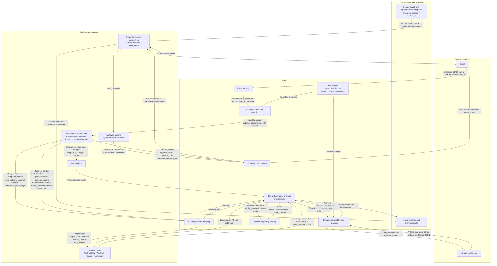

# SalesMate Agent MVP

For graph-model tool integration, first read [Graph Model and Agent Tool Handoff](../backend/docs/semantic-agent-handoff.md). The existing HTTP SDK/stdio MCP can be called independently. graph.ingest persists observations and constructs the graph, but it is not registered in this directory's workspace-chat automatic tool flow. Natural-language requests on the small server remain subject to timeout and must not use L1's four-way concurrency strategy.

## Global Insights Collection

`python -m agent.world_insights` is a one-shot collection task independent of Gmail, L1-L4, and chat. It discovers semiconductor equipment, precision metrology, and related industry news and events through the public GDELT searches, NIST/Eurostat feeds, and semiconductor event calendars configured in `world_insights_sources.json`, without a news-search API key. News requires a timezone-aware publication date supplied by the source page or feed; the model only organizes source excerpts and must not invent countries. Map events require explicit names, dates, cities, and countries from structured Event data on source pages, and are saved only after Nominatim validates city coordinates. When a source supplies a date without a time, records explicitly mark the time as a system placeholder. Entries without locations are skipped rather than assigned guessed positions. Each pass writes at most 4 news items and 2 events, deduplicates existing source URLs, and isolates individual failures.

Known legacy Eurostat indicator URLs matching `/eurostat/product?code=4-<eight digits>-ap` are canonicalized to the official same-host `/eurostat/en/web/products-euro-indicators/w/...` form for fetching, deduplication, and new records. Existing database records are not rewritten automatically and require explicit backend maintenance. Fetching still validates public DNS, HTTPS, response type, and size, and follows no other redirects. `world_item_failed` logs the stage, exception type, and safe failure reason.

The news model also extracts companies, event types, projects, explicit and potential needs with rationale, time windows, and original evidence from the same source excerpt. Amounts require currency, amount type, scope, original evidence, and values verifiable against that evidence. These fields remain empty when no company-level event can be verified. The agent now attaches them directly to `world_news.create`, so **extend the backend `world_news` write contract before enabling production collection**; the current backend rejects the added fields with 400. `--dry-run` previews complete write payloads without backend writes. URL deduplication does not enrich records saved under the old contract; schedule a separate backfill.

Install `agent/requirements.txt` from the project root and configure the existing Bailian environment variables plus separate `SALESMATE_TOOLS_URL` and `SALESMATE_TOOLS_TOKEN`. The tool credential must allow at least `world_news.list/create` and `world_events.list/create`; Gmail/chat worker Agent credentials cannot substitute for it. In production, place tool settings in `/opt/salesmate/shared/world-insights.env`, readable only by the `salesmate` service user, and exclude it from Git.

```bash
python -m agent.world_insights --dry-run
python -m agent.world_insights
sudo install -m 644 agent/deploy/salesmate-world-insights.service /etc/systemd/system/
sudo install -m 644 agent/deploy/salesmate-world-insights.timer /etc/systemd/system/
sudo systemctl daemon-reload
sudo systemctl enable --now salesmate-world-insights.timer
sudo systemctl start salesmate-world-insights.service
sudo journalctl -u salesmate-world-insights.service -n 100 --no-pager
```

The service runs at 03:00 and 15:00 UTC daily by default, with a randomized delay. `--dry-run` accesses public sources, geocoding, and the model but does not invoke backend write tools. Inspect `news`, `events`, `source_successes`, `source_errors`, `item_errors`, and `write_errors` in the result. The task exits nonzero when all sources are unavailable or all attempted writes fail; individual source/item failures are logged while others continue. A pass may produce no records when sources are unreachable or lack reliable dates/locations. Configure the geocoding cache path with `SALESMATE_WORLD_GEO_CACHE`.

**Shared employee access:** All authenticated employees can read global news and events; writes remain subject to tool allowlists and owner permissions, while customers and opportunities retain their own access boundaries. Existing deployment scripts do not install this timer automatically; do not enable it before adapting the backend for the new sales-lead fields.

Updated: 2026-09-20<br>
Version: v2.5<br>
Status: Employee web Gmail authorization, one-shot synchronization requests, and the existing L1-L4 pipeline have completed integration checks. Workspace chat is connected to backend request-bound read-only customer tools; joint acceptance with the real model and web UI remains pending.

## 1. Current scope

2026-09-13 software integration update: Django's independent `crm_worker` schedules the product workflow, with persistent raw-email/L1 caches, deduplicated synchronization within explicit user scope, and manual extraction retries. Since 2026-09-20, full-history backfill and expired-History fallback are disabled. The one-shot CLI descriptions below remain for module debugging; do not use the legacy CLI to write cursors for worker-managed mailboxes. Inbound emails without a purchasing stage enter review, and source changes invalidate and recompute L2-L4. See [email processing integration](../backend/docs/processing-integration.md) for current operation and recovery boundaries. This validation used mocked Gmail/model services and does not establish live integration of the new flow.

This directory handles Gmail understanding and company-level sales analysis:

```text
Employee authorizes Gmail in the web UI
  -> Django saves the employee mailbox connection; the employee selects days or a message count and creates a synchronization request
  -> Agent claims authorization and synchronization scope once
  → Gmail
  -> L1 extracts facts from each email
  -> DjangoBackendClient submits to the real backend
  -> Backend persists, deduplicates, groups, and creates jobs
  -> L2 merges company facts
  -> L3 generates customer profiles, analysis, and sales signals
  -> L4 scores follow-up priority
  -> DjangoBackendClient persists results to the real backend
```

The agent provides neither an HTTP service nor a database. Django owns employee sessions, Google OAuth, mailbox credentials, companies, tickets, quotations, orders, jobs, and persisted analysis. The agent reads and writes through the existing `/api/v1/agent/` HTTP API. The adapter handles backend service authentication, ETags, and job leases outside L1-L4 business workflows.

Each Agent service credential belongs to one backend employee. The shared `crm_worker` creates a temporary employee credential per work unit and revokes it afterward; the CLI retains its configured single-employee credential. The agent claims mailbox synchronization requested by that employee in the UI. Backend grouping and page queries remain employee-isolated, so the frontend represents the current employee's Gmail inbox, not a company-wide shared inbox.

This directory contains workspace-chat skills, model adapters, workflows, a one-shot CLI, and offline tests, but no chat HTTP server, database, authoritative conversation store, or polling loop. Chat uses backend-authorized customer search/detail tools bound to employees and requests; it does not send email, schedule calendar actions, or write CRM/files. The backend and frontend own UI entry points, conversation storage, permissions, and persistence.

### 1.1 Workspace chat (the only chat flow)

Chat writes now use [durable browser approval](../backend/docs/chat-approvals.md). The Agent supplies its loop checkpoint, releases the Worker on `approval_required`, and resumes the same request after approval using the canonical mutation receipt. No prompt approval or Agent credential can substitute for the browser decision; rejection cancels the request without changing earlier history. Tool/model budgets and scheduled workflows remain unchanged.

`workflows/chat.py` runs only `skills/workspace-chat/SKILL.md` (`workspace-chat-v3`), without selecting modes by customer binding or environment variables. Employees ask workspace questions with no preselected `company_id` in internal Agent requests. The current backend omits that field; the HTTP adapter still removes transitional `company_id: null` and rejects non-null values. Ordinary questions may be answered directly. For customer data, the model selects `customers.search` and `customers.context`; the latter's `company_id` applies only to that query. The agent validates arguments against the request's published catalog and performs at most 6 tool calls. Shared experiment questions may use `experiments.catalog`, `experiments.rows`, and `experiments.file_read`, retaining synthetic markers, batches, and original ownership, with evidence registered by the backend. Explicit fictional-data maintenance may also use `experiments.create/update/delete`, taking arguments from the actual catalog and supplying current fingerprints for updates/deletes; backend-persisted receipts are citable. The backend checks employee/request permissions and registers each read's evidence. The agent cites only authorized sources actually displayed in this round; long customer details enter the model as marked excerpts while the backend retains complete sources.

`generate_chat_json()` in `llm/bailian.py` requests a JSON object. Model output selects another read-only query or the final answer; citations must match this round's authorized sources and body numbers must agree with the citation list. Without evidence, ordinary conversation, clarification, or an explicit insufficient-information answer is permitted. Direct requests to send email, schedule calendar actions, or write business data receive a non-execution explanation. Tool-level argument errors or unavailable details may be corrected or answered within the same request; request-level errors end the round.

`process_chat_once()` claims at most one request and attempts one report, returning `None` when idle. If the report response is lost, it queries authoritative backend state once and treats the result as successful only when persistence is confirmed. Workspace chat is enabled by default with no feature flag or legacy fallback. See the [backend workspace-chat contract](../backend/docs/workspace-chat-tools.md) for interfaces and permission boundaries.

### 1.2 One-shot chat CLI

Run from the project root:

```powershell
python -m agent.main --process-chat-once
```

The command reuses `.env` loading and `DjangoBackendClient`: claim zero or one request, generate a stable result, attempt reporting, and exit immediately. Standard output is UTF-8 JSON. No work or `completed` exits normally; `failed`, including local `report_failed`, exits nonzero. This option is mutually exclusive with `--analysis-company-id`, `--process-jobs-once`, and `--sync-authorized-mailboxes-once`. It is not a daemon; repeated demo execution requires an external scheduler or existing worker to invoke it serially.

### 1.3 Chat integration contract

`DjangoBackendClient` implements these Agent-side HTTP mappings, reusing existing `Authorization: Agent <service-token>` and timeout settings with minimal response-contract validation:

| Agent method | Protected path | Agent behavior |
|---|---|---|
| `claim_answer_request()` | `POST chat/requests/claim/` | Send `{}`; normalize `{"request": null}` to no work; omitted or null `company_id` means no preselected company; reject non-null values |
| `get_answer_context(request_id, scope)` | `POST chat/context/` | Allow only `internal|external`; independently validate customer context, knowledge state, retrieval gaps, and external availability |
| `get_chat_tools(request_id)` | `GET chat/tools/` | Retrieve the read-only tools and argument schemas actually published for this request; unnecessary for ordinary questions |
| `get_chat_request_status(request_id)` | `GET chat/requests/<request_id>/` | Check authoritative terminal state only when reporting cannot be confirmed, without rerunning models or tools |
| `report_answer(result)` | `POST chat/answers/` | Report `chat_prompt_version`, `completed|failed`, answer, citations, and safe errors; accept first-save or idempotent duplicate responses |
| `read_chat_tool(request_id, name, arguments)` | `POST chat/tool-reads/` | Allow only catalog-published customer search/detail and shared experiment reads; validate request, tool, read ID, and registered evidence, preserving tool/request error scope |

`backend/apps/chat/` provides employee binding, evidence snapshots, idempotent results, and one unique assistant message. The independent `chat_worker` invokes `process_chat_once()`. The agent neither overrides employee identity/backend visibility nor connects directly to knowledge stores. Only employee-visible customers and explicit internal knowledge are currently used; external knowledge remains disabled.

### 1.4 Agent delivery and web demo delivery

Unit tests here continue using fake sessions/backends and do not constitute real-model or production-web acceptance. New backend integration tests run the original Agent HTTP client/workflow against real PostgreSQL and a temporary Django HTTP service with mocked model output; browser tests use real pages and mocked APIs.

The web demo still requires corresponding backend migrations, model/backend configuration, `python backend/manage.py chat_worker`, and joint acceptance with the real model and web UI. The agent produces only `workspace-chat-v3` results. The frontend has removed customer-specific chat entry points; the new worker explicitly terminates old active company jobs at startup while retaining history, without converting or reassigning old questions. Failed requests cannot be reset and reused with their original `request_id`.

### 1.5 Offline chat tests

```powershell
# Workspace chat, CLI/Bailian regressions, and mocked HTTP contracts
python -m unittest agent.tests.test_workspace_chat agent.tests.test_core agent.tests.test_http_backend

# Complete offline Agent suite, including existing L1-L4 pipeline regressions
python -m unittest discover -s agent/tests -p "test_*.py"
```

`test_workspace_chat.py` uses an in-memory backend and mocked model for ordinary conversation, customer search/details, cross-company citations, tool errors, unauthorized sources, long excerpts, and report confirmation. Offline tests send no customer data or credentials to external services; real-model/web end-to-end acceptance still requires deployment.

Development logs correlate stages by `request_id`, `gmail_message_id`, `company_id`, and `job_id`: Gmail reads and individual submissions, L1 extraction/retries, L2 merging, L3 model/cache, L4 signals/scoring, chat model/tools/reporting, and backend HTTP failures. Logs record state, counts, elapsed time, and exception types, excluding OAuth tokens, API keys, complete model output, and full customer context. For example:

```bash
sudo journalctl -u salesmate-chat -f
sudo journalctl -u salesmate-crm -n 300 --no-pager | grep -E 'gmail_sync_|l1_email_|l3_analysis_|l4_|company_analysis_'
```

## 2. Directory responsibilities

```text
agent/
├── main.py                         # One-shot Gmail, L2, chat, and real-backend job CLI
├── config.py                       # Shared configuration from the project-root .env
├── clients/
│   ├── __init__.py                 # External service client exports
│   └── backend_api.py              # BackendClient protocol, Django API, and chat tool mappings
├── tools/
│   ├── gmail.py                    # Backend authorization, Gmail History, and email reads
│   └── email_parser.py             # MIME, body, and quoted-history parsing
├── llm/
│   └── bailian.py                  # Bailian JSON-object requests for L1/L3 and ordered chat
├── skills/
│   ├── loader.py                   # Skill discovery, metadata parsing, and process-local caching
│   ├── email-fact-extraction/
│   │   └── SKILL.md                # L1 extraction instructions, version, and output limit
│   ├── customer-analysis/
│   │   └── SKILL.md                # L3 profile instructions, version, and output limit
│   └── workspace-chat/
│       └── SKILL.md                # workspace-chat-v3 read-only customer tool selection and answers
├── workflows/
│   ├── l1_email.py                 # L1 single-email fact extraction
│   ├── gmail_sync.py               # Frontend Gmail synchronization service function
│   ├── authorized_gmail_sync.py    # Claim and process employee web synchronization requests
│   ├── analysis_input.py           # L2 company fact merging and metrics
│   ├── customer_analysis.py        # L3 customer profiles and analysis
│   ├── lead_score.py               # L4 deterministic priority scoring
│   ├── orchestration.py            # L2-L4 and one-shot job processing
│   └── chat.py                     # Workspace read-only queries, answers, and one-shot orchestration
└── tests/
    ├── __init__.py                 # Test package marker
    ├── email_submission_exploration.py  # Shared L1 fixtures and data-contract boundary tests
    ├── fake_backend.py             # Protocol fake used only in offline tests
    ├── test_workspace_chat.py      # Workspace read-only queries, citations, and unauthorized-action tests
    ├── test_core.py                # L1, CLI, Bailian client, and data-contract unit tests
    ├── test_integration.py         # Gmail read-only access, History, and Bailian client integration tests
    ├── test_analysis_input.py      # L2 AnalysisInput behavior tests
    ├── test_http_backend.py        # Django HTTP transport and mocked chat contract tests
    ├── test_mvp_pipeline.py        # Gmail synchronization and L2-L4 pipeline tests
    └── test_lead_score.py          # Company-level L4 rules and ranking tests
```

There is no separate `schemas` or `prompts` layer. Model capabilities live in `agent/skills/<skill-name>/SKILL.md`: frontmatter provides routing name, purpose, version, and output-token limit, while the body contains model instructions. Workflows load skills by name and only assemble current input, call Bailian, and validate results. Data structures remain plain dictionaries and a few local dataclasses.

Available workflow skills:

| Skill | Stage | Input boundary | Output |
|---|---|---|---|
| `email-fact-extraction` | L1 | One parsed email subject and current body | Email facts with original evidence |
| `customer-analysis` | L3 | One company-level `AnalysisInput` | Customer profiles, analysis, signals, and scoring features |
| `workspace-chat` (`workspace-chat-v3`) | Workspace chat | Current question, recent history, internal knowledge, and backend request-bound read-only tool results | Customer search/detail selection and sourced answers |

`agent.skills.list_skills()` returns routable skill names, descriptions, versions, instructions, and output limits. Increment `metadata.version` whenever instruction changes affect model behavior. Future email sending, meeting scheduling, or other writes require separate authorization and confirmation designs; current `workspace-chat` does not perform them.

QQ mail is an additional independent IMAP source, preserving Gmail integration. `tools/qq_mail.py` provides a read-only adapter for the fixed QQ TLS service; backend `qq_sync` persists synchronization and reuses L1-L4 without a Google callback domain. See [QQ mailbox trial](../backend/docs/qq-mailbox.md) for configuration and compatibility boundaries. QQ runs through `crm_worker`; the legacy Gmail CLI does not claim QQ jobs.

## 2.1 Module interaction flow

The overview shows business and data flow between modules. Later sections describe internal decisions, validation, and calculation rules.



### Data exchanged by stage

| Stage | Direction | Main input fields | Main output fields | Purpose |
|---:|---|---|---|---|
| 1. Employee mailbox authorization | Browser ↔ Django ↔ Google | Employee session, OAuth code | mailbox_id, mailbox_address, authorization state, sync_requested | Bind the Gmail account actually selected by the employee without exposing tokens to the browser |
| 2. Synchronization claim and email reads | Django → Agent ↔ Gmail | mailbox_id, authorization, read limit | message_id, thread_id, raw MIME, received_at | Read the employee's recent incoming/outgoing emails once |
| 3. Email parsing | Gmail → Parser → L1 | Raw MIME and Gmail metadata | subject, body_text, from, to, cc, sent_at, direction | Convert Gmail resources into a common email structure |
| 4. Single-email extraction | Skill → L1 → Backend | `email-fact-extraction` instructions and normalized email | EmailSubmission: dedupe_key, contact_email, extract_status, facts | Extract at most four emails concurrently; isolate individual failures |
| 5. Persistence and grouping | Agent → Backend | Completed individual EmailSubmission | Per-email result, company_id, company member emails, necessary pending jobs | Submit each completed L1 result immediately without waiting for the slowest email; independent transactions prevent one conflict from rolling back the batch |
| 6. Synchronization result | Agent → Django → Browser | Backend persistence results | fetched_count, l1_processed_count, created_count, duplicate_count, failed_extraction_count, failed_submission_count, email_errors, synchronization state | Report immediately after the mailbox stage; retain failed IDs for subsequent retries |
| 7. Analysis job entry | Backend → Orchestration | job_id, trigger, company_id | Companies requiring analysis in this batch | Convert email/business-data changes into company analysis jobs |
| 8. Company data preparation | Backend → L2 | Grouping, emails, customer, contacts, tickets, quotations, orders, snapshot version, scoring context | Complete company data collection | Provide shared context for company fact merging and L4 |
| 9. Company fact merging | L2 → Orchestration and backend | Company data collection | AnalysisInput: company, business_context, facts, metrics, input_version, unparsed_message_count | Establish L3's sole trusted analysis input |
| 10. Analysis cache check | Backend → Orchestration | company_id, input_version | Existing Analysis or null | Avoid repeated model calls for the same data version |
| 11. Profiles and analysis | Skill → L3 ↔ Bailian | `customer-analysis` instructions and reduced AnalysisInput inference view | Analysis: company/ticket signals, industry, size, summary, three profile dimensions, four analysis dimensions; legacy scoring features retained temporarily for backend validation | Preserve complete L2 for validation/storage; L4 no longer calculates scores from legacy features |
| 12. Follow-up priority | Orchestration → L4 | L1 purchasing stage and company scoring context | Company Score, components, reasons, evidence, and next action | Pure Python rules; produce a provisional score with missing-field annotations when a stage exists but business data is incomplete |
| 13. Persist analysis | Orchestration → Backend | AnalysisInput, Analysis, Score, JobReport | Latest company analysis state | Include `score_details` in the same Score submission when data is complete; record provisional missing fields in `score_reasons` |
| 14. Return to caller | Orchestration → Backend → Browser | Complete analysis results | AnalysisBundle, JobReport, and company page projection | CLI prints processing reports; frontend reads results through the backend |

There is no frontend JSON-file upload or backend disk-file response in this flow. Agent workflows exchange plain dictionaries, and `DjangoBackendClient` converts them into HTTP JSON requests/responses. Frontend queries, filtering, sorting, and pagination continue using Django browser endpoints.

Local configuration and test injection use these files; Django stores web OAuth credentials:

| Local file | Reader | Purpose | Exchanged with frontend/backend? |
|---|---|---|---|
| `.env` | Django, Agent, and Bailian client | Shared local backend, model, and Agent API configuration | No |
| `test_tools/gmail_inject_credentials.json` | `test_tools/gmail_test_injector.py` | Desktop OAuth configuration dedicated to test-email injection | No |
| `test_tools/gmail_inject_token.json` | `test_tools/gmail_test_injector.py` | OAuth token cache dedicated to test-email injection | No |

`agent/tests/fake_backend.py` is used only by automated tests without network/database access, never by the CLI or deployments. Django persists all runtime data.

## 3. L1: Email fact extraction

Entry point:

```python
process_email(email, mailbox_address, extraction_provider) -> EmailSubmission
```

Processing order:

1. Gmail tools read raw emails.
2. `email_parser.py` parses MIME, subject, body, addresses, and timestamps.
3. Compare `from` with the authorized mailbox to determine inbound/outbound direction.
4. Select the primary external contact.
5. Skip the LLM for automatic, marketing, and no-reply emails.
6. Call Bailian for business-email facts.
7. Verify evidence is locatable in the current subject/body. If default Bailian output fails only JSON-structure or evidence validation, retry once immediately with the validation reason.

Main `EmailSubmission` fields:

```json
{
  "dedupe_key": "sales@example.com:gmail-message-id",
  "mailbox_address": "sales@example.com",
  "gmail_message_id": "gmail-message-id",
  "thread_id": "thread-id",
  "from": "buyer@example.com",
  "to": ["sales@example.com"],
  "cc": [],
  "sent_at": "2026-09-12T10:00:00+08:00",
  "received_at": "2026-09-12T02:00:00+00:00",
  "subject": "采购咨询",
  "body_text": "需要 50 台检测设备，请提供报价。",
  "direction": "inbound",
  "contact_email": "buyer@example.com",
  "non_business_hint": false,
  "non_business_reason": null,
  "extract_status": "completed",
  "extract_prompt_version": "extract-v7",
  "extract_error": null,
  "facts": {}
}
```

`facts` contains exactly 17 fields:

- `has_substantive_update`
- `message_summary`
- `intent_hint`
- `intent_evidences`
- `contact_name`
- `contact_title`
- `company_self_reported`
- `business_background`
- `employee_scale_hint`
- `product_need`
- `quantity`
- `budget`
- `delivery_time`
- `decision_process`
- `concerns`
- `quote_reference`
- `order_reference`

Each of the 13 regular fact fields has this shape:

```json
[
  {
    "value": "50 台",
    "evidences": ["需要 50 台检测设备"]
  }
]
```

Unknown facts are empty arrays. A fact may contain multiple values and each value multiple evidence snippets. The project no longer uses a `requirements` field.

`intent_hint` is the highest verifiable purchasing stage in one customer email: `L1 Exploring`, `L2 Interested`, `L3 Qualified`, `L4 Evaluating`, `L5 Negotiating`, or `L6 Purchase Ready`. Without verifiable intent it is `null` and `intent_evidences=[]`; a stage requires at least one original-evidence snippet from the current email. Field counts and other regular-fact structures remain unchanged. Submission and L2 accept only `extract-v7`, excluding legacy stage enums.

## 4. Gmail synchronization interface

In the production page flow, employees complete OAuth in Django and the backend starts the agent. Retain this command for manual debugging with automatic execution disabled:

```powershell
python -m agent.main --sync-authorized-mailboxes-once
```

The product entry point uses independent `crm_worker` durable batches. This debugging command obtains mailbox address, authorization, frozen `sync_options`, and explicit retry IDs through `claim_mailbox_syncs()`. The agent must enforce the selected scope; legacy requests lacking both scope and IDs fail instead of implicitly becoming full synchronization. After submitting scope, the browser reads and polls state.

`sync_gmail()` is the lower-level synchronization function. Direct calls require backend authorization and mailbox_id; debugging entry point `sync_authorized_mailboxes_once()` claims them from the backend, while the product uses durable workers:

```python
from agent.clients.backend_api import DjangoBackendClient
from agent.workflows.gmail_sync import sync_gmail

backend = DjangoBackendClient(
    "http://127.0.0.1:8000/api/v1/agent/",
    "agent-service-token",
    mailbox_id="backend-mailbox-uuid",
)
result = sync_gmail(
    {
        "mailbox_id": "mb1",
        "access_token": "direct-access-token",
        "mailbox_address": "sales@example.com",
        "max_results": 20,
    },
    backend=backend,
)
```

`mailbox_address` may be omitted to read the Gmail profile. `max_results` must be 1-20 and controls lower-level page size. Web-claimed `sync_options` contains `recent_days`, `max_messages`, `since`, and `until`, frozen by the backend at request time. Gmail defaults to at most 50 emails even for day-only requests. Counts above 50 require explicit user approval and `allow_large_sync=true`; unlimited approval is prohibited. Truncate recent-message counts before skipping stored mailbox/message-ID pairs, without scanning older emails to fill the count. Failed IDs remain for explicit retries and ordinary scoped synchronization does not redo them implicitly. `sync_gmail` retains a no-`sync_options` cursor protocol for module tests; product workers and web claim entry points do not use it.

Preserve existing L1 concurrency of at most four, immediate submission, validation correction, and failure isolation. Workers reuse persisted raw-email and L1-output caches; worker-managed mailboxes must not share legacy CLI cursor writes, and configured read/write errors propagate explicitly. See [email processing integration](../backend/docs/processing-integration.md) for initial authorization, scope validation, and recovery boundaries.

The standard L1 `EmailSubmission` retains the preceding business fields. The HTTP adapter additionally supplies `mailbox_id` and `source=gmail_real` for backend transport without degrading multi-value facts into the backend's current legacy single-value shape.

Successful result:

```json
{
  "mailbox_id": "mb1",
  "status": "completed",
  "sync_mode": "incremental",
  "cursor_saved": true,
  "fetched_count": 5,
  "pending_message_count": 0,
  "retry_message_count": 0,
  "failed_email_count": 0,
  "l1_processed_count": 2,
  "skipped_existing_count": 3,
  "created_count": 1,
  "updated_count": 1,
  "duplicate_count": 3,
  "failed_extraction_count": 0,
  "failed_submission_count": 0,
  "email_errors": [],
  "affected_company_ids": ["company-1", "company-2"],
  "job_reports": [],
  "error": null
}
```

The lower-level function handles only Gmail, L1, and individual submissions. The independent product `crm_worker` schedules synchronization and company profiles concurrently, persisting each completed email while the frontend reads batch progress and current customer results separately. The retained Gmail CLI synchronizes first, then handles company jobs; use it only for isolated debugging, never on the same mailbox as the new worker. Callers populate `job_reports` after `process_jobs_once()`.

Required backend submission rules:

- Do not persist the same `dedupe_key` twice.
- Update facts when an existing `failed` record receives a new `completed` result.
- Group corporate email by domain.
- Group common public email by the complete contact address.
- New companies have no CRM profile by default.
- Create analysis jobs only for business emails with `has_substantive_update=true`.

## 5. L2：AnalysisInput

Entry point:

```python
build_analysis_input(
    company_id,
    backend=backend,
    merge_version="merge-v2",
    clock=clock,
) -> AnalysisInput | ValidationError
```

L2 does not call an LLM. It reads `Grouping` and `CompanyContext` from the backend to:

- Merge facts from multiple emails without loss
- Attach `dedupe_key` and `fact_time` to every fact
- Compute incoming/outgoing counts, substantive inbound counts, and the latest response interval
- Count unparsed emails
- Carry contact, customer, ticket, quotation, and order context
- Compute a cacheable `input_version`

Output structure:

```json
{
  "company_id": "company:example.com",
  "input_version": "sha256:...",
  "merge_version": "merge-v2",
  "external_snapshot_version": "ext-3",
  "built_at": "2026-09-12T10:01:00+08:00",
  "company": {
    "company_name": "Example",
    "crm_status": "unregistered",
    "domains": ["example.com"],
    "contacts": []
  },
  "business_context": {
    "customer": {},
    "tickets": [],
    "quotes": [],
    "orders": []
  },
  "latest_message_summary": "客户要求提供正式报价",
  "member_dedupe_keys": [],
  "unparsed_message_count": 0,
  "facts": {},
  "metrics": {}
}
```

`input_version` is computed from email `dedupe_key`, extraction version/status, `merge_version`, and backend `external_snapshot_version`. The real backend must update `external_snapshot_version` whenever business data changes.

Backend business context uses these minimal object shapes:

```json
{
  "contact": {
    "contact_email": "buyer@example.com",
    "contact_name": "王宇",
    "interaction_count": 3,
    "is_primary": true
  },
  "customer": {
    "customer_id": "customer-1",
    "industry_from_crm": "工业自动化",
    "employee_count": 260,
    "employee_count_source": "crm",
    "first_deal_at": "2025-06-01T08:30:00+08:00"
  },
  "ticket": {
    "ticket_id": "ticket-1",
    "name": "设备采购跟进",
    "stage": "需求沟通",
    "amount": null,
    "currency": "CNY",
    "owner": "Demo Sales"
  },
  "quote": {
    "quote_id": "quote-1",
    "ticket_id": "ticket-1",
    "sent_at": "2026-09-10T11:00:00+08:00",
    "amount": 280000,
    "currency": "CNY",
    "status": "sent",
    "evidence_type": "actual_outbound"
  },
  "order": {
    "order_id": "order-1",
    "closed_at": "2025-06-01T08:30:00+08:00",
    "amount": 450000,
    "currency": "CNY",
    "products": ["工业传感器"],
    "source_system": "erp"
  }
}
```

## 6. L3: Customer profiles and analysis

Entry point:

```python
generate_analysis(
    analysis_input,
    analysis_provider=bailian_analysis_provider,
    clock=clock,
) -> dict
```

One Bailian call generates the Agent fields required by pages A and B. Before calling, construct a reduced inference view from complete `AnalysisInput`: retain company, business context, fact values/times/sources, metrics, and analysis reference time; remove cache-only version fields, duplicate member lists, and copies of original evidence already validated by L1. Complete L2 remains available for result validation and backend persistence.

`list_view` contains the main company signal and evidence, per-ticket signals, industry, size band, latest summary, and three scoring features valued 0-3 or `null`.

Main signal enum:

- `repeat_purchase`
- `quoted_not_closed`
- `inquiry_intent`
- `new_lead_no_profile`
- `unknown`

Signal evidence requirements:

- `quoted_not_closed` requires a quotation with `evidence_type=actual_outbound`.
- `repeat_purchase` requires both historical orders and a new purchasing action.
- `inquiry_intent` requires explicit product, quantity, budget, or delivery facts.
- `new_lead_no_profile` requires an unregistered lead with only one inbound email.
- Return `unknown` when evidence is insufficient.

`detail_view.profile` contains `industry_context`, `company_ops`, and `intent`; `detail_view.analysis` contains `timeline`, `opportunity`, `risk`, and `guidance`.

All seven dimensions use:

```json
{
  "facts": [{"text": "...", "source_refs": ["source-id"]}],
  "inferences": [
    {
      "text": "...",
      "basis": "...",
      "confidence": "high",
      "source_refs": ["source-id"]
    }
  ],
  "missing_fields": []
}
```

Backend `source_refs` retain the existing contract: email `dedupe_key`, `company_id`, `customer_id`, contact email, ticket/quotation/order IDs, and registered experiment sources. Model-side `analysis-v5` uses input-specific short IDs such as `src_001` and attaches `source_ref` to facts and business objects; Python restores complete IDs before existing validation and submission. Complete allowlisted IDs returned directly by the model are also accepted; source identity is never guessed from email-ID suffixes or similar addresses. `latest_message_summary` lacks an explicit email-source binding, so it remains only in the L2 snapshot rather than independent L3 evidence. Field names such as `metrics` and `facts` are not sources either.

L3 rejects invalid sources, unsourced facts/inferences, invalid enums, deal probabilities, incorrect size bands, and signals below their evidence thresholds. Python generates `context_completeness` from the L2 count: note is null when no emails are unparsed, otherwise it states the count and incomplete coverage. Missing, empty, or wrongly typed model values no longer invalidate the entire profile. If unparsed emails exist and missing_fields is empty, the program adds that known gap.

Single-layer JSON Markdown fences, duplicate citations, and system completeness fields are handled locally without another model call. Complete standalone inability-to-assess statements such as “目前无法判断成交概率” and their supported English equivalents are paraphrased as “The available information does not establish a deal outcome.” for backend compatibility, logging `l3_probability_denial_normalized`. Numbers, citations, conditions, affirmative predictions, and compound sentences are not removed or changed by this rule. For other JSON/business-rule failures, the default provider sends the specific error, valid source mapping, and previous complete output (up to 32000 characters, omitted when larger) for one targeted correction; a second invalid result fails, and network errors are not retried automatically. Probability errors include the field path and matched keyword without logging full customer sentences or model output. Frontend/backend keyword restrictions remain; broader negative/unknown semantics require coordinated changes. Actual probability predictions remain prohibited, while business percentages such as payment proportions alone do not trigger the restriction.

Historical orders for `repeat_purchase` must come from `business_context.orders`; email claims and `facts.order_reference` cannot substitute for backend orders. `size_band` and `size_source` use backend customer headcount or verified experimental headcount, returning `unknown` when unavailable. Conflict fields are restricted to the thirteen L1 fact fields; occasional model `company_name` is normalized to `company_self_reported`, and other invalid fields fail before submission. This changes neither L1, persisted L2 format, L4 formulas, nor backend interfaces. `analysis-v5` separates old cached analyses, and new results still require an explicit analysis request.

Failure returns `status=failed`, `list_view=null`, `detail_view=null`, and local diagnostic errors without caching the analysis.

Successful `Analysis` example:

```json
{
  "company_id": "company:example.com",
  "input_version": "sha256:...",
  "analysis_prompt_version": "analysis-v3",
  "generated_at": "2026-09-12T10:02:00+08:00",
  "analysis_base_time": "2026-09-12T10:01:00+08:00",
  "status": "completed",
  "list_view": {
    "signal": "repeat_purchase",
    "signal_evidence": {
      "text": "历史订单客户再次提出明确采购需求",
      "source_refs": ["order-1", "sales@example.com:gmail-message-id"]
    },
    "ticket_signals": [
      {
        "ticket_id": "ticket-1",
        "signal": "repeat_purchase",
        "reason": "存在历史订单和本次新采购动作"
      }
    ],
    "industry": "工业检测",
    "industry_evidence": {
      "text": "CRM 行业和邮件产品需求指向工业检测",
      "source_refs": ["customer-1", "sales@example.com:gmail-message-id"]
    },
    "size_band": "200_500",
    "size_source": "crm",
    "headline_summary": "客户要求在截止日前取得正式报价",
    "score_features": {
      "demand_clarity": {"value": 3, "basis": "产品、数量和报价要求明确"},
      "urgency": {"value": 3, "basis": "存在明确回复截止日"},
      "decision_visibility": {"value": 2, "basis": "已知项目负责人和内部汇报安排"}
    }
  },
  "detail_view": {
    "conflicts": [],
    "profile": {
      "industry_context": {
        "facts": [{"text": "CRM 行业为工业自动化", "source_refs": ["customer-1"]}],
        "inferences": [],
        "missing_fields": []
      },
      "company_ops": {
        "facts": [{"text": "公司员工数为 260", "source_refs": ["customer-1"]}],
        "inferences": [],
        "missing_fields": []
      },
      "intent": {
        "facts": [{"text": "客户要求正式报价", "source_refs": ["sales@example.com:gmail-message-id"]}],
        "inferences": [],
        "missing_fields": []
      }
    },
    "analysis": {
      "timeline": {
        "facts": [{"text": "客户再次发起采购咨询", "source_refs": ["sales@example.com:gmail-message-id"]}],
        "inferences": [],
        "missing_fields": []
      },
      "opportunity": {
        "facts": [{"text": "客户有一笔历史订单", "source_refs": ["order-1"]}],
        "inferences": [{"text": "存在复购机会", "basis": "历史订单加本次新采购动作", "confidence": "high", "source_refs": ["order-1", "sales@example.com:gmail-message-id"]}],
        "missing_fields": []
      },
      "risk": {
        "facts": [],
        "inferences": [],
        "missing_fields": ["最终审批人"]
      },
      "guidance": {
        "facts": [],
        "inferences": [{"text": "优先确认最终审批人", "basis": "当前决策链信息不完整", "confidence": "medium", "source_refs": ["ticket-1"]}],
        "missing_fields": []
      }
    },
    "missing_fields": ["最终审批人"],
    "context_completeness": {
      "unparsed_message_count": 0,
      "note": null
    }
  },
  "error": null
}
```

## 7. L4: Follow-up priority

Entry point:

```python
compute_score(analysis, analysis_input, clock=clock, priority_context=context) -> dict
```

`score` expresses current sales-processing priority, not deal probability. Each company still receives one score through L2→L3→L4. L4 makes no LLM calls; L2 passes L1 `intent_hint` stages with email sources and evidence. Without a verifiable purchasing stage, return `score=null`. With a stage but incomplete opportunity/fit data, normalize available dimensions into a provisional score and describe missing fields in `score_reasons`.

The formula is `35% × urgency + 35% × buying_intent + 30% × opportunity_value`, where `opportunity_value = 60% × deal_value + 40% × customer_fit`. Urgency scores are 100 within 4 hours, 90 within 24 hours, 80 within 2 days, 65 within 7 days, 45 within 14 days, 25 later, and 10 without an explicit time; customer reminders without deadlines also score 10. Date-only emails use the scoring clock's calendar day conservatively: today scores 90 and the next 1-2 days 80, without inventing hours. Expired ordinary deadlines stop raising urgency; only explicit `OVERDUE_ACTION` contributes overdue urgency. Buying intent scores are 20 for general inquiries, 40 for product/demo interest, 60 for quantity/budget/purchase timing, 75 for formal quotations/decision makers, 90 for contract/payment discussion, and 100 for approval/purchase confirmation. Deal-to-historical-average ratios in the same currency map `<0.5 / [0.5,1) / [1,2) / [2,5] / >5` to `20/40/60/80/100`. Customer fit weights are industry 25, size 15, geography 10, product 35, and comparable won deals 15.

`priority_context` is company-level L4 context excluded from persisted L2 `AnalysisInput`:

```json
{
  "customer": {"customer_id": "C001", "company_name": "Example Manufacturing", "industry": "Manufacturing", "company_size": 100, "country": "Singapore"},
  "deal": {"deal_value": "250000", "currency": "SGD", "stage": "Proposal", "product": ["WMS", "OHT"], "quantity": 20, "status": "ACTIVE"},
  "seller": {
    "average_deal_value": "30000", "average_deal_currency": "SGD",
    "time_zone": "Asia/Singapore",
    "target_industries": ["Manufacturing"],
    "target_company_size": {"min": 20, "max": 500},
    "service_regions": ["Singapore"], "products": ["WMS"],
    "similar_won_deals": true
  }
}
```

`deal` retains the formal opportunity field names but is aggregated to company level under the product contract; score only company opportunities with `status=ACTIVE` and a positive amount. L2 reads purchasing stages from the latest 20 completed email extractions and selects the highest stage supported by original evidence, using `dedupe_key` as source ID. L4 validates sources, applies rules, and explains results without another model call. Without an explicit follow-up deadline, urgency uses the baseline 10. Existing `delivery_time` text is not automatically a sales follow-up deadline, so companies relying only on new stage fields usually use that baseline. Missing opportunity/fit data never produces invented amounts: if both are missing, normalize urgency and intent in a 35:35 ratio; if only one is available, use it as provisional opportunity value with 35/35/30 weights. Integer contributions sum exactly to the score. `rank_company_scores()` orders by descending score, urgency contribution, and company ID, placing null scores last; backend company lists follow the same ordering.

`compute_priority_result()` returns the existing backend `score` payload and `score_details` in one L4 computation: raw component scores/contributions, the top three reasons by impact, email-linked evidence, and suggested next action. `analyze_company()` saves `score` and includes `score_details` when complete components are computable. Provisional scores retain missing-data explanations in `score_reasons` and omit incomplete `score_details`. The backend persists full explanations and exposes them through company details. Existing `Score.score` is the documented `priority_score`; no second score field is added.

The backend returns company-level active opportunities, customer, and seller data in `CompanyContext.priority_context`, aggregating amounts only within the same currency. Relevant business changes update versions and enqueue analysis. The `score-v2` persistence endpoint accepts provisional scores without legacy L3 features; full explanations can be stored with scores and retrieved through company details. The frontend currently shows only the total and `score_reasons`; displaying the top three reasons, separate evidence links, and recommended actions requires frontend changes. Independent `rules` mode remains the old integration placeholder algorithm; use Agent mode for formal evaluation.

Offline validation: `python -m unittest agent.tests.test_lead_score`. Tests use a fixed clock and fake signals without Bailian or the real backend.

## 8. Orchestration and backend interfaces

Complete company analysis:

```python
analyze_company(
    company_id,
    backend=backend,
    analysis_provider=bailian_analysis_provider,
    clock=clock,
) -> AnalysisBundle
```

Execution order: build/save L2; query L3 cache; call Bailian on a miss; save only validated L3; compute/save L4; return L2, L3, L4, cache status, and errors.

One-shot job processing:

```python
process_jobs_once(
    backend=backend,
    limit=10,
    analysis_provider=bailian_analysis_provider,
    clock=clock,
) -> list[JobReport]
```

Supported triggers are `email_ingested`, `customer_detail_opened`, `external_updated`, and `grouping_changed`. The function claims a batch and returns after processing, analyzing each company at most once per batch. Agent workflows implement no resident polling or automatic task retries; the single validation-correction attempt in L1/L3 is not a task retry. `DjangoBackendClient` manages leases and version headers required by Django.

For backend request failures, `analysis_job_failed` includes `http_status`, `backend_code`, and `retry=explicit`. The agent neither directly retries HTTP 409 nor bypasses version checks. Job reports retain the existing contract; the backend and business caller must request new analysis from current data.

Agent workflows depend on `agent.clients.backend_api.BackendClient`:

```python
submit_emails(submissions)
get_company_grouping(company_id)
get_company_context(company_id)
save_analysis_input(analysis_input)
get_latest_analysis_input(company_id)
get_cached_analysis(company_id, input_version)
save_analysis(analysis)
save_score(score)
claim_jobs(limit)
report_job(report)
claim_mailbox_syncs(limit)
report_mailbox_sync(report)
```

`agent.clients.backend_api.DjangoBackendClient` adapts the current Django API as follows:

- Use `Authorization: Agent <service-token>`.
- Add `mailbox_id` and `source=gmail_real` to email submissions.
- Execute L1 with at most four concurrent calls and aggregate individual backend results into synchronization statistics.
- Record individual lookup, L1, or submission failures in `email_errors` and retry IDs without rolling back other emails.
- Store and forward Grouping/CompanyContext ETags.
- Read the top-level `company_id` from backend jobs.
- Store `lease_token` and `expected_version` internally and attach headers when writing L2/L3/L4.
- Map cache misses to `None`; require complete Analysis on hits.
- Claim Gmail synchronization for the employee owning the current service credential and report state/refreshed authorization.
- Read/save Gmail `historyId` through existing `sync-state` endpoints, skipping unchanged historical emails before L1 on subsequent passes.
- Identify completed same-version records through the compatible per-email query; creating the first cursor does not overwrite existing facts with new model output.

The adapter retains 17-field multi-value facts; `extract-v7` changes `intent_hint` enum semantics. Django submission, manual resubmission, and L2 accept only the new contract, while inbound emails without a purchasing stage enter manual review. Before deploying this version, clear legacy emails and durable synchronization cursors; resynchronization then generates `extract-v7` facts through L1.

## 9. Running

Install dependencies from the project root:

```powershell
python -m pip install -r requirements.txt
```

The project-root `.env` must contain at least:

```text
DASHSCOPE_API_KEY=...
BAILIAN_BASE_URL=https://dashscope.aliyuncs.com/compatible-mode/v1
BAILIAN_MODEL=model-name
SALESMATE_BACKEND_AGENT_URL=http://127.0.0.1:8000/api/v1/agent/
SALESMATE_AGENT_SERVICE_TOKEN=backend-generated-agent-service-token
SALESMATE_MAILBOX_ID=backend-created-mailbox-uuid
SALESMATE_JOB_LEASE_SECONDS=120
SALESMATE_BACKEND_TIMEOUT=30
```

Django reads web Gmail OAuth `GOOGLE_OAUTH_CLIENT_ID`, `GOOGLE_OAUTH_CLIENT_SECRET`, and callback configuration from the same root `.env`; the agent needs no duplicate settings.

```powershell
# Read real backend company data and only build/output L2
python -m agent.main --analysis-company-id <COMPANY_UUID>

# Claim a real backend job batch, run L2-L4 once, and exit
python -m agent.main --process-jobs-once --job-limit 10

# Claim employee web Gmail synchronization and run this L1-L4 pass
python -m agent.main --sync-authorized-mailboxes-once

# Claim and answer at most one chat request, then exit
python -m agent.main --process-chat-once
```

`--process-chat-once` is the one-shot workspace-chat Agent client entry point, using protected claim, context, tool-read, and report endpoints. It starts no HTTP server, database, or resident loop. The backend owns requests, authorized context, tool evidence, assistant/citation persistence, and browser state projections; the runner handles continuous job claiming.

Web authorization establishes employee mailbox connections through Django without exposing tokens to the browser. On-demand Agent execution or `--sync-authorized-mailboxes-once` debugging claims them from protected Agent APIs. Legacy local Desktop OAuth commands `--message-id`, `--recent`, and `--sync-gmail` were removed to avoid maintaining credentials alongside the official web flow.

### 9.1 Inject end-to-end samples into a test Gmail account

Without multiple real external contact accounts, the independent test tool inserts six synthetic RFC 2822 emails directly into the developer's own Gmail. It neither calls/modifies the backend nor sends email to external addresses. The web app still retrieves them using existing read-only OAuth, exercising Gmail, L1, backend grouping, and L2-L4. Gmail `messages.insert` bypasses most normal delivery scanning, so this does not validate SMTP, SPF, DKIM, or spam classification.

The injector lives in `test_tools/` alongside `agent/` and `backend/` and is independently usable by developers/testers. See [test tool instructions](../test_tools/README.md) for preparation, permissions, full-flow verification, and cleanup. Create a separate **Desktop app** OAuth client in Google Cloud Credentials, rename its downloaded JSON to `gmail_inject_credentials.json`, and place it in `test_tools/`. Do not use the backend's Web application client: it permits registered Django callbacks, not the injector's random localhost port. Add the test Gmail account to OAuth consent-screen Test users. Preview the samples:

```powershell
python -m test_tools.gmail_test_injector --dry-run
```

Insert the samples:

```powershell
python -m test_tools.gmail_test_injector
```

The tool defaults to `test_tools/gmail_test_messages.template.json`; `--messages-file` selects another tester-supplied JSON file. Top-level `mailbox_address` identifies the mailbox. Initial execution reads Git-ignored `test_tools/gmail_inject_credentials.json`, requests `gmail.insert` and `gmail.readonly` in the browser, and stores a separate token in `test_tools/gmail_inject_token.json`. It checks the authorized account matches the JSON mailbox, then inserts the defined emails. Confirm the subject prefix in Gmail and click the localized Gmail synchronization action in SalesMate. To select another account or reauthorize, delete `test_tools/gmail_inject_token.json` and rerun.

For reliable History cursor capture, first complete ordinary Gmail authorization and synchronization in SalesMate, then run injection. These emails enter through Gmail and therefore show `gmail_real` as transport source. Use a dedicated test Gmail and database; afterward, search Gmail for the reported subject prefix and delete the samples manually.

## 10. Tests

```powershell
# Complete offline tests
python -m unittest discover -s agent/tests -p "test_*.py"

# MVP pipeline tests
python -m unittest agent.tests.test_mvp_pipeline
```

Automated tests do not connect to real Gmail, Bailian, databases, HTTP, or knowledge services. Live integration uses only nonsensitive demo data for manual smoke checks. The documented complete offline discovery command passes 189 tests.

Test responsibilities:

| File | Responsibility |
|---|---|
| `agent/tests/email_submission_exploration.py` | Shared L1 fixtures and EmailSubmission contract boundaries; imported by `test_core.py` because its name does not start with `test_` |
| `agent/tests/test_workspace_chat.py` | Workspace customer search/details, citations, tool failures, and one-shot reporting |
| `agent/tests/test_core.py` | Bailian client, chat CLI regressions, Gmail resources, MIME, evidence boundaries, L1 prompts, extraction, and EmailSubmission contracts |
| `agent/tests/test_integration.py` | Gmail read-only access, History pagination/expiration, profile fallback, and Bailian integration boundaries |
| `agent/tests/test_analysis_input.py` | L2 fact merging, business context, versions, and error boundaries |
| `agent/tests/test_mvp_pipeline.py` | Gmail synchronization, L1 concurrency/failure isolation, L2-L4, caching, and existing end-to-end flows |
| `agent/tests/test_lead_score.py` | Official company scoring formula, signal evidence, deadline bands, insufficient data, and ranking |
| `agent/tests/test_http_backend.py` | Django service authentication, mailbox/cursor/ETag/job leases, response normalization, and mocked chat contracts |
| `agent/tests/test_qq_mail.py` | QQ IMAP read-only adapter boundaries |

`agent/tests/fake_backend.py` is only an existing-flow fixture; chat's in-memory fake backend also simulates external contracts only. Neither participates in runtime execution or real backend persistence.

## 11. Contracts aligned with Django

The real backend implements these contracts:

1. Email deduplication accepts `mailbox_address:gmail_message_id`, with adapter-supplied `mailbox_id` validating ownership.
2. L1 uses `intent_evidences`; the 13 regular fact fields contain multiple `{value, evidences[]}` groups, with `[]` for unknown values.
3. Ordinary submission returns `updated` when an existing failed extraction receives a completed replacement.
4. Create `email_ingested` jobs only for business emails with `has_substantive_update=true`.
5. AnalysisInput accepts and preserves `company`, `business_context`, and `latest_message_summary`; L2 facts retain all `evidences`.
6. Cache hits return complete Analysis.
7. Persist `missing_fields` and `context_completeness` in `detail_view`.
8. Unknown values for the three scoring features use JSON `null`.
9. Valid L3 `source_refs` include customer_id and contact email.
10. Jobs carry top-level `company_id`; legitimate duplicate company jobs may report `skipped`.
11. `sync-state` returns ETag/version and uses `If-Match` when the agent saves Gmail `historyId`, requiring no new endpoint.
12. The per-email `failed-extractions` query returns current EmailSubmission so the agent can skip trusted same-version terminal states before L1 and continue failed/new emails.
13. Submissions retain `POST emails/`, but the agent sends one element per request to isolate individual failures using existing atomic transactions, requiring no new endpoint.

## 12. Current limitations

- Initial Gmail synchronization scans only the latest 20 emails. After saving `historyId`, it pages through new records and retains IDs beyond the per-pass limit for later passes. Expired cursors merge existing pending/failed IDs with a recent scan rather than clearing unfinished lists.
- The backend currently queries stored emails individually, adding at most 20 lightweight HTTP queries during initial scans/cursor fallback. A future batch-status endpoint could consolidate them without changing current correctness.
- L1 permits at most four concurrent calls instead of twenty simultaneous Bailian requests. Reduce Agent concurrency if the account is rate-limited. L2-L4 process company jobs independently, with the backend coalescing multiple email updates into one latest company job.
- Independent `crm_worker` consumes durable batches and profile jobs; the CLI remains one-shot debugging and web execution starts no Agent threads.
- The agent still submits rule-classified `skipped_non_business` emails. Completed inbound extractions without verifiable purchasing stages use `intent_hint=null` and enter backend manual review; the frontend displays backend classifications.
- Web restarts do not delete database jobs. Worker HTTP failures are explicit, and the progress page supports explicit retries of failed emails.
- L3 does not use external industry news or knowledge bases.
- L4 weights have not been calibrated with real sales samples.
- The backend/frontend implement actual filtering, sorting, pagination, CRM profile creation, and rendering.

Software workers supply `sync_gmail` with optional progress observation and explicit retry message_ids. Observation mode registers messages before reading and isolates individual read failures. Existing CLI defaults remain unchanged. See [processing integration](../backend/docs/processing-integration.md).

## Supplementary company experiment data

L2 copies backend CompanyContext.company_enrichment directly and includes the complete object in input_version, without new tool credentials, paginated retrieval, or repeated Agent entity matching. L3 `analysis-v5` accepts registered experiment sources in that snapshot, preferring CRM headcount and otherwise using experimental headcount marked `synthetic_sample`. Model input includes only supplementary facts, `source_id`, its short `source_ref`, fictional markers, and necessary state, excluding backend-maintenance metadata such as owner, fingerprints, batches, and versions. L1/L4 and model budgets remain unchanged. See the [backend integration contract](../backend/docs/company-enrichment.md).
