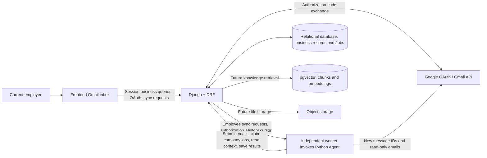

# SalesMate architecture and technology choices (provisional)

Updated: 2026-09-13

Status: this page retains architectural direction and extension plans. The application [README](../README.md) defines current implementation: Django/Agent integrate over HTTP, local development uses PostgreSQL selected explicitly by DATABASE_URL, and rules mode serves offline demonstrations only. Subsequent RAG/complex assistants have not been introduced in this documented baseline.

## 1. Goals and scope

The backend centers on Django, supporting email understanding, company grouping, customer business data, asynchronous analysis, and page queries, with extension paths for RAG and multiround assistants.

The existing email-understanding flow is the development foundation. Knowledge bases, industry news, sidebar assistants, translation, real sending, and post-send opportunity writeback still require team agreement on scope/ownership. Recording technical options does not include them all in MVP.

Requirements derive from the [SalesMate MVP product specification, September 9 update](https://docs.google.com/document/d/1IG0NtzszF1-RVtFgIuH_4KKTUuhKrehARNn_H6gt3aQ/edit) and the team's Email Understanding Agent Module Design v1.11. Offline summaries of these and early proposals are in the [project references](project-reference.md); summaries do not replace originals or later API contracts.

## 2. Overall architecture



Production extensions may place PostgreSQL/pgvector in one instance with separate business/index tables. This MVP baseline does not use vector retrieval.

- **Frontend:** employee Gmail authorization/synchronization, company-grouped lists, details, and business interactions.
- **Django:** authentication, Google credentials, mailbox ownership, business data, company entity decisions, persistent tasks, context queries, result storage, filtering/sorting/statistics.
- **Agent:** Gmail reads, fact extraction, input merging, analysis generation, scoring.
- **Data/knowledge:** authoritative facts, original materials, traceable snapshots, knowledge indexes.

Agent accesses business data through APIs, never directly through tables. Future LangGraph checkpoints use separate tables/schemas and are not authoritative business storage.

## 3. Provisional stack

| Layer | Provisional choice | Purpose and adoption stage |
|---|---|---|
| Business framework | Django 5.2 LTS with an appropriate implementation-time patch | Stage 1: models, migrations, logic, users, administration |
| API | Django REST Framework (DRF) | Stage 1: frontend/Agent APIs, validation, authorization |
| Framework helpers | django-environ, drf-spectacular, Uvicorn | Introduced: environment configuration, OpenAPI, local ASGI |
| Business database | PostgreSQL locally / explicitly configured SQLite | Emails, companies, opportunities, versions, results, Jobs |
| Agent runtime | Independent Python service | Stage 1: existing pull-based task claiming |
| Agent orchestration | Plain Python for fixed flows; proposed LangGraph for complex assistants | Multiround chat, tool selection, durable steps, human confirmation |
| Generative model | Existing Agent Bailian configuration | Framework changes do not automatically alter models/experiments |
| Vector retrieval | pgvector + pgvector-python | Knowledge stage: chunks/vectors through Django ORM |
| Embeddings | Bailian multilingual embeddings; text-embedding-v4 candidate | Select after bilingual example and regional-availability evaluation |
| Document parsing | Docling | Knowledge stage: product PDFs with structure/source locations |
| Original files | S3-compatible object storage, provider undecided | Knowledge/file-generation stage: originals, attachments, artifacts |
| Background document work | Celery + Redis | Adopt for parsing/embedding jobs |
| Agent observability | Langfuse | Model integration: trace models/retrieval/tools, latency, cost, quality |
| Local development | Python environment + explicit database configuration | Unified `requirements.txt` and root `.env` |
| Later deployment | Docker Compose + Linux containers | Validate packaging after the first runnable backend; standardize deployment |

See [local development](local-development.md). Validate/lock PostgreSQL, extension, and container versions before production. Hosted versus self-hosted Langfuse is undecided; self-hosting resources need assessment.

## 4. Backend modules

Organize Django apps by business responsibility; initial proposal:

See [project structure](project-structure.md) for layout, internal responsibilities, and interface files. Create planned directories as features arrive, without numerous empty modules.

| Module | Responsibility |
|---|---|
| `accounts` | Users, teams, permissions, mailbox ownership, Agent authentication |
| `mailbox` | Deduplicated email storage, facts/versions, failed extractions, sync state |
| `customers` | Companies, contacts, grouping, CRM registration |
| `sales` | Opportunities, quotes, orders, snapshot versions |
| `analysis` | Input snapshots, profiles, analyses, scores, citations |
| `jobs` | Creation, atomic claims, leases, reports, status |
| `knowledge` (later) | Documents, chunks, vectors, authorization, retrieval, index versions |

Define sending/draft/conversation module boundaries after confirming product scope. Django Admin supports maintenance/diagnosis, but grouping/version/recalculation changes must still follow business rules, task triggers, and consistency checks.

## 5. Task and Agent coordination

Email understanding retains persistent backend Jobs and Agent Pull:

1. Employees initiate OAuth; Django callbacks verify Gmail profiles and persist connections.
2. Frontends request sync; Django creates MailboxSyncRun and returns HTTP 202.
3. Independent workers claim batches/authorization and invoke Agent; initial scans read recent emails, later scans prefer History increments.
4. Agent reuses successful extractions and processes new/retryable L1 emails at up to four-way concurrency, submitting each immediately on completion.
5. Django saves email/facts in per-email transactions, groups within employee scope, and creates company Jobs for substantive business changes.
6. Workers persist per-email state/report batches; independent profiling channels claim company Jobs/context concurrently.
7. Agent merges L2, generates L3, computes L4, saves results, and reports Jobs.
8. Frontends quietly poll and progressively show saved emails/company states.

Job is authoritative for company-analysis status. Backend handles atomic claims, credentials, leases, and stale-write prevention. api-contract.md fixes HTTP versions, credentials, and failure semantics already integrated with Agent. MailboxSyncRun/EmailProcessingJob persist batches/per-email stages; employees retry explicitly without implicit fallback.

Future Celery/Redis document jobs do not redispatch the same email-analysis Job. LangGraph manages internal Agent steps without replacing backend task state/permissions.

The local MVP stores Google authorization JSON in Django; browsers never see access/refresh tokens. Agent writes refreshed credentials through protected APIs. Production should migrate credentials to encrypted fields/secret services. Real sending requires a separately defined higher-permission authorization flow if included.

## 6. RAG data and execution

### 6.1 Three storage categories

| Data | Location | Examples |
|---|---|---|
| Authoritative business records | Ordinary PostgreSQL tables | Current prices, inventory, quotes, orders, permissions |
| Chunks/vectors | PostgreSQL + pgvector | Product features, FAQs, solution descriptions |
| Original files | Object storage | Product PDFs, proposal attachments |

Query time-sensitive prices, inventory, and order states through structured APIs; retrieved documents cannot override current business records.

### 6.2 Document ingestion

```text
Upload → Save original → Background parse → Structural chunking
       → Generate embeddings → Save chunks/vectors/sources/versions → Mark searchable
```

Each chunk identifies team, document/version, page/section, content, embedding model/dimensions. Document replacement/deletion updates indexes together. Index failures require explicit states so incomplete versions are not presented as complete.

Select and version embedding models, dimensions, chunking, and retrieval parameters after evaluation. Model changes require corresponding index rebuilds; never mix vector spaces.

### 6.3 Retrieval and answers

Example: a user asks for inspection equipment within Engineer Li's budget.

1. Agent reads customer needs, budget, and historical orders from backend APIs.
2. Retrieve authorized product-description chunks.
3. Verify current prices, inventory, and lead times through business APIs.
4. Generate cited recommendations from retrieval evidence/business results.
5. Django checks permissions and user confirmation for any generated/executed business action.

Backend retrieval constrains teams, resources, and active document versions. Vector hits are not authorization; filters also govern chunks/original downloads.

Validate basic vector retrieval before evaluating keyword hybrids/reranking for missed recall. Include exact product models/numbers in evaluation. Never fix unassessed thresholds or broaden retrieval to manufacture success.

## 7. Observability and runtime

- Correlate API/task/model logs using request_id, job_id, company ID, input version, and model/prompt versions.
- Log necessary context at submission, grouping, claims, model calls, saves, and failures.
- Langfuse traces retrieval/models/tools/evaluations, not authoritative customer records.
- Never log tokens/keys; minimize email/profile content and define transmission scope before external tracing.
- Windows development uses Linux containers or WSL2 for Celery workers; Celery does not officially support native Windows.
- LangGraph suspension is not business approval; backend validates actual action/version before sending/writeback.
- Current local development retains D-drive Conda/PostgreSQL; new environments may use root Python venv. Frontend is same-origin native HTML/CSS/JavaScript. Root `.env` supplies connections; later containers reinstall locked dependencies.

## 8. Phased adoption

| Phase | Deliverables/components | Acceptance focus |
|---|---|---|
| 1: Email analysis loop | Django, DRF, relational database, independent Agent, Jobs | Company submission/grouping/claims/saves/pages; duplicates/failures |
| 2: Knowledge, after scope approval | knowledge, pgvector, Docling, object storage, Celery/Redis, embeddings | Ingestion, citations, isolation, updates/deletion, retrieval quality |
| 3: Complex assistants, after scope approval | LangGraph, conversations/workflow state, confirmation | Multistep tools, pause/resume, traceability, no duplicate execution |
| Model integration | Langfuse, fixed examples/evaluation records | Evidence, retrieval hits, cost, latency, version effects |

## 9. Open decisions

- Inclusion/ownership of knowledge, industry news, translation, sidebar assistants, real sending.
- Worker deployment, real interruptions, multiprocess load tests; persistent batches/progress already exist.
- Profile concurrency capacity; current default is two, with company exclusion/latest pending revision merging.
- Review criteria for missing procurement stages and L1 repair versions after manual confirmation; classification/filtering/review exist in [processing integration](processing-integration.md).
- Production Gmail encryption, worker deployment, monitoring.
- Model regions, embeddings, chunking, retrieval evaluations/index parameters.

## 10. Official references

- [Django support](https://www.djangoproject.com/download/)
- [Django REST Framework](https://www.django-rest-framework.org/)
- [pgvector](https://github.com/pgvector/pgvector)
- [Django pgvector integration](https://github.com/pgvector/pgvector-python#django)
- [LangGraph](https://docs.langchain.com/oss/python/langgraph/overview)
- [Bailian embeddings](https://help.aliyun.com/zh/model-studio/embedding)
- [Docling](https://docling-project.github.io/docling/)
- [Celery platform support](https://docs.celeryq.dev/en/stable/getting-started/introduction.html)
- [Langfuse](https://langfuse.com/docs)
