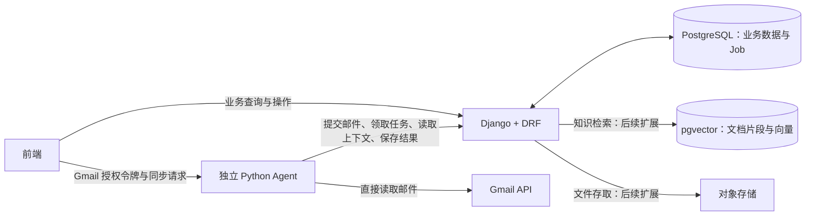

# SalesMate 架构与技术选型（暂定）

更新日期：2026-09-12

状态：架构方向与后续扩展规划。当前已实现 Django/PostgreSQL 邮件业务闭环、原生同源前端和显式规则占位；业务集中于 crm app，内部以服务文件分工。实际接口见 [API 契约](api-contract.md)，占位替换见 [Agent 接入](agent-integration.md)。后续 RAG 与复杂助手尚未引入。

## 1. 目标与范围

后端以 Django 生态为核心，支持邮件理解、公司归组、客户业务数据、异步分析与页面查询，并为后续 RAG 和多轮助手提供扩展路径。

当前邮件理解流程是开发基础。知识库、行业资讯、右栏助手、翻译、真实发送及发送后的商机写回，仍需团队确认本期范围和负责人；记录相关技术方案不等于将这些功能全部纳入 MVP。

需求依据为 [SalesMate MVP 产品功能文档（0909 更新）](https://docs.google.com/document/d/1IG0NtzszF1-RVtFgIuH_4KKTUuhKrehARNn_H6gt3aQ/edit) 及团队提供的《邮件理解 Agent · 模块设计》v1.11。两者及早期技术方案的本地摘要已收录到[项目参考总览](project-reference.md)，可离线阅读；摘要不替代原文及后续接口契约。

## 2. 总体架构



图中的 PostgreSQL 与 pgvector 在初期可部署于同一个数据库实例，使用不同表管理业务记录和知识索引。

- **前端**：Gmail 授权、同步入口、公司列表、客户详情及业务交互。
- **Django 后端**：鉴权、业务数据、公司实体决策、任务持久化、上下文查询、分析结果存储、筛选排序与统计。
- **Agent**：读取 Gmail、抽取邮件事实、归并分析输入、生成分析、计算评分。
- **数据与知识层**：保存权威业务事实、原始材料、可追溯的分析快照和知识索引。

Agent 通过后端 API 访问业务数据，不直接读写业务表。后续如使用 LangGraph，其工作流检查点使用独立表或 schema，不承担业务记录的权威存储职责。

## 3. 暂定技术栈

| 层次 | 暂定选择 | 用途与引入时机 |
|---|---|---|
| 业务框架 | Django 5.2 LTS，使用实施时适用的补丁版本 | 第一阶段：模型、迁移、业务逻辑、用户与管理后台 |
| API | Django REST Framework（DRF） | 第一阶段：面向前端与 Agent 的接口、输入校验和权限 |
| 框架辅助 | django-environ、drf-spectacular、Uvicorn | 已引入：环境配置读取、OpenAPI 生成和本地 ASGI 启动 |
| 业务数据库 | PostgreSQL | 第一阶段：邮件、客户、商机、版本、分析结果和 Job |
| Agent 运行 | 独立 Python 服务 | 第一阶段：沿用 Agent 主动领取任务的 Pull 模式 |
| Agent 编排 | 固定流程先用普通 Python；复杂助手拟用 LangGraph | 多轮对话、工具选择、持久化步骤及等待人工确认时引入 |
| 生成模型 | 沿用 Agent 侧现有百炼模型配置 | 不因后端框架变化自动更换模型或实验条件 |
| 向量检索 | pgvector + pgvector-python | 知识库阶段：通过 Django ORM 管理文档片段与向量 |
| Embedding | 百炼多语言向量模型，text-embedding-v4 作为候选 | 知识库阶段：根据中英文项目样例验证效果与地域可用性后确定 |
| 文档解析 | Docling | 知识库阶段：解析产品 PDF 等文档，保留结构与来源定位 |
| 原文件存储 | S3 兼容对象存储，服务商待定 | 知识库或文件生成功能启用时：保存原文件、附件和产物 |
| 后台文档处理 | Celery + Redis | 文档解析和向量生成等后台工作启用时引入 |
| Agent 可观测性 | Langfuse | 模型联调阶段：跟踪模型、检索和工具调用，检查耗时、费用与质量 |
| 本地开发 | D 盘 Conda 环境 + 本地 PostgreSQL/pgvector | 当前本地 PostgreSQL 16 与迁移已完成 |
| 后续部署 | Docker Compose + Linux 容器 | 首个可运行后端版本完成后验证打包，部署阶段统一运行环境 |

本机已验证的 Python 与基础库版本见[本地开发环境](local-development.md)。PostgreSQL、后续扩展库及容器镜像的具体版本，在实施前完成兼容性验证并锁定。Langfuse 的托管或自建方式尚未确定；自建资源需求需另行评估。

## 4. 后端功能模块

建议按业务职责组织 Django app，以下为初始划分。

目录布局、模块内部文件职责和三方接口文件约定见[项目目录与文件规划](project-structure.md)。规划中的目录按功能逐步创建，不预先生成大量空模块。

| 模块 | 职责 |
|---|---|
| `accounts` | 用户、团队、权限、邮箱业务归属、Agent 服务鉴权 |
| `mailbox` | 邮件去重存储、抽取事实及版本、失败抽取读取、同步状态 |
| `customers` | 公司、联系人、归组规则、CRM 建档状态 |
| `sales` | 商机、报价、订单及业务快照版本 |
| `analysis` | 分析输入快照、画像、分析结果、评分与来源引用 |
| `jobs` | 任务创建、原子领取、租约、回报及状态查询 |
| `knowledge`（后续） | 文档、分块、向量、权限过滤、检索与索引版本 |

真实发送、草稿和助手会话的模块边界，在其产品范围确认后单独定义。Django Admin 用于内部维护和诊断；涉及归组、业务版本或重算的修改仍需经过业务规则，不能绕过任务触发和一致性检查。

## 5. 任务与 Agent 的协作

现有邮件理解任务继续使用后端持久化 Job 和 Agent Pull：

1. 前端将当前 Gmail 授权令牌交给 Agent，触发同步。
2. Agent 读取邮件并提取事实，通过 API 提交给 Django。
3. Django 在数据库事务中保存邮件与事实、完成归组并创建相应 Job。
4. Agent 通过领取接口取得任务，再查询公司上下文。
5. Agent 完成 L2 归并、L3 分析与 L4 评分，提交结果并回报任务状态。
6. 前端通过后端查询接口获取结果与处理状态。

Job 表是邮件理解任务状态的权威来源。后端负责原子领取、领取凭证、租约校验和防止过期任务覆盖新结果；HTTP 版本、领取凭证和失败语义已在 api-contract.md 固化，待与团队 Agent 实际联调。重试次数、退避与失败处理必须显式约定，不加入隐式回退。

Celery + Redis 用于后续文档处理等单独任务，不再次派发同一份邮件分析 Job。LangGraph 管理 Agent 内部执行步骤，也不替代后端的业务任务状态与操作权限。

Gmail 同步保持当前前端提供令牌的设计，不引入令牌托管或自动刷新。真实发送若进入本期，需另行定义其授权链路。

## 6. RAG 的数据与执行路径

### 6.1 三类存储

| 数据 | 存放位置 | 例子 |
|---|---|---|
| 权威业务记录 | PostgreSQL 普通表 | 当前价格、库存、报价、订单、客户权限 |
| 文档片段与向量 | PostgreSQL + pgvector | 产品功能、FAQ、解决方案说明 |
| 原始文件 | 对象存储 | 产品手册 PDF、方案附件 |

价格、库存、订单状态等时效性业务事实通过结构化接口查询；检索到的文档不能覆盖当前业务记录。

### 6.2 文档入库

```text
上传文档 → 保存原文件 → 后台解析 → 按结构分块
        → 生成 Embedding → 保存片段、向量、来源和版本 → 标记可检索
```

每个片段至少关联所属团队、文档 ID 与版本、页码或章节、内容及 Embedding 模型和维度。替换或删除文档时同步处理其索引；索引构建失败要显式记录状态，避免把不完整的新版本展示为已完成。

Embedding 模型、维度、分块策略和检索参数在评测后确定并版本化。更换 Embedding 模型时需重建对应索引，不能混用不同向量空间。

### 6.3 检索与回答

例如用户询问：“帮李工推荐预算内的检测设备。”

1. Agent 调用后端，读取客户需求、预算和历史订单。
2. Agent 调用知识检索接口，获取有权访问的产品说明片段。
3. Agent 调用业务接口，核查产品当前价格、库存与交期。
4. 模型结合检索证据和业务结果生成建议，并引用来源。
5. 如需生成或执行业务动作，由 Django 校验相应权限及用户确认。

后端在检索查询中限制团队、资源访问范围及有效文档版本。向量结果不构成访问授权；权限过滤同样适用于片段返回和原文件下载。

先验证基础向量检索，再根据漏召回场景评估关键词混合检索和重排序。产品型号、精确数值等场景需纳入评测；不得未经评估固定阈值或扩大检索范围来制造成功结果。

## 7. 可观测性与运行环境

- 使用 `request_id`、`job_id`、公司 ID、输入版本和模型/提示词版本串联 API、任务与模型日志。
- 在数据提交、归组、任务领取、模型调用、结果保存和失败分支记录必要上下文。
- Langfuse 用于追踪检索、模型及工具调用和评测，不作为客户业务数据的权威来源。
- 令牌、密钥不进入日志；邮件正文和客户资料只记录诊断所需内容，接入外部追踪服务前明确发送范围。
- Windows 开发环境中的 Celery Worker 使用 Linux 容器或 WSL2；Celery 官方不支持原生 Windows。
- LangGraph 的暂停状态不等于业务操作已获批准；实际发送和写回仍由后端验证具体动作及版本。
- 当前使用本地 Conda + WSL PostgreSQL 开发；前端为 Django 同源的原生 HTML/CSS/JavaScript；连接配置通过环境变量读取，路径避免写死 Windows 盘符。后续容器按锁定依赖重新安装 Python 环境，不直接复制 Windows Conda 环境。

## 8. 分阶段引入

| 阶段 | 交付与组件 | 验收重点 |
|---|---|---|
| 1：邮件分析闭环 | Django、DRF、PostgreSQL、独立 Agent、Job 协议；数据库可预备 pgvector 扩展 | 单公司提交、归组、领取、分析保存与页面查询；重复提交和失败路径 |
| 2：知识库（范围确认后） | `knowledge`、pgvector、Docling、对象存储、Celery + Redis、Embedding | 文档入库、来源引用、权限隔离、文档更新删除和检索质量 |
| 3：复杂助手（范围确认后） | LangGraph、会话与工作流状态、用户确认流程 | 多步工具调用、暂停恢复、结果可追溯、动作不重复执行 |
| 模型联调阶段 | Langfuse、固定样例与评测记录 | 事实依据、检索命中、成本、延迟及版本变化的影响 |

## 9. 联调前待确定

- 知识库、行业资讯、翻译、右栏助手及真实发送是否进入本期，各由谁负责。
- `AnalysisInput` 如何完整携带 L3 所需的客户、工单、报价、订单数据及其来源。
- 分析提示词版本、评分规则版本和评分基准时间如何参与缓存与幂等键。
- 非实质新邮件与分析缓存的关系，避免“无需重算”与详情页缓存未命中相互冲突。
- 上下文快照版本、失败抽取正文读取、任务租约和过期结果写入协议。
- 邮箱与用户/团队归属、数据访问规则，以及公司归组异常场景的 MVP 边界。
- 模型地域、Embedding、文档分块、检索评测及索引参数。

## 10. 官方参考

- [Django 版本支持](https://www.djangoproject.com/download/)
- [Django REST Framework](https://www.django-rest-framework.org/)
- [pgvector](https://github.com/pgvector/pgvector)
- [pgvector 的 Django 集成](https://github.com/pgvector/pgvector-python#django)
- [LangGraph](https://docs.langchain.com/oss/python/langgraph/overview)
- [百炼向量化模型](https://help.aliyun.com/zh/model-studio/embedding)
- [Docling](https://docling-project.github.io/docling/)
- [Celery 与平台支持](https://docs.celeryq.dev/en/stable/getting-started/introduction.html)
- [Langfuse](https://langfuse.com/docs)
