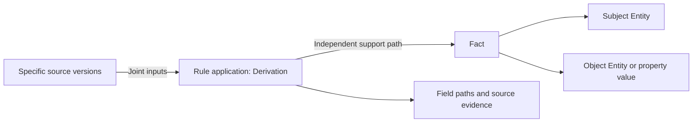

# SalesMate traceable business knowledge graph

Added on 2026-09-24: full business-schema projection, incomplete structured observations, local Qwen natural-language linking, and automatic email input; see [automatic graph construction](semantic-graph.md). This page retains initial mapping/historical validation. New scope follows that document/current `graph/schema/`. Ordinary graph workers still call no models; the independent ingestion path does.

The initial version provides PostgreSQL graph storage, transactional change capture, maintenance workers, backfill, and read-only HTTP. Business databases remain authoritative; graphs are rebuildable derived read models. Structured data maps foreign keys/states; text reuses persisted L1 only, without new LLM calls, training, or external communication.

## Purpose and scenarios

- Company context: contacts, opportunities, orders, products, customer statements.
- Opportunity assistants: evidence-backed need/budget/delivery candidates with original support.
- Cross-selling inputs: purchase relations supported by confirmed/fulfilled orders; queries return evidence, not product recommendations.
- Audit/correction: trace exact source-record versions and revoked support.

Email statements attach to companies without inferred opportunity assignments. Opportunity product names remain properties, not automatic Product matches. Review candidates are neither confirmed demand nor purchase probabilities. Automatic chat calls, graphical browsers, semantic entity merging, arbitrary multihop queries, and external graph databases were not implemented in this initial version.

## Models



| Model | Responsibility |
| --- | --- |
| `Entity` | Stable identity from owner/source model/primary key; names are labels only |
| `SourceVersion` | Allowlisted snapshot, fingerprint, version; no historical overwrites |
| `Fact` | Subject, predicate, object/property; structured versus extraction provenance |
| `Derivation` | Versioned rule, all input versions, field/source evidence |
| `Support` | Fact-to-derivation edge; multiple orders independently support purchases |
| `Change` | Same-transaction business event storing ownership, source identity, operation only |
| `ProjectionState` | Built state, last successful time, generation |

Inputs within a derivation are AND dependencies; different derivations of one fact provide OR support. Cancelling one of two supporting orders revokes one path; only removing the final support makes the fact `unsupported`.

`active` means current rules support an assertion, not human confirmation. `needs_review` denotes multiple budget/quantity/delivery candidates requiring temporal/opportunity review; it neither declares contradiction nor selects arbitrarily. `unsupported` preserves history outside current lists.

SourceVersion `current` means it matches that source record's current fields; Derivation `active` determines whether rules still use it. An old extraction may remain stored while a newer extraction replaces its historical support.

Source versions are snapshots actually used by the graph. Multiple writes before worker execution merge into the current consistent snapshot, retaining events without inventing unused intermediate versions. `recorded_at` is graph recording time; email `observed_at` is original email time. Arbitrary historical bitemporal queries are not provided.

## Sources and rules

Migrations install row-level INSERT/UPDATE/DELETE capture and statement-level TRUNCATE capture on these initial ten tables:

| Source | Projection |
| --- | --- |
| `crm.Company` | Company entity/ownership |
| `crm.Contact` | Contact entity, `has_contact` |
| `crm.Mailbox` | Email access/ownership dependency; no credentials |
| `crm.Email` | Business-email entity, `has_email`, classification/review version |
| `crm.Extraction` | Selected latest-extraction fact groups as source versions |
| `sales.CompanySettings` | Company archive/restore dependency |
| `sales.Product` | Product entity, `catalog_price` |
| `sales.Opportunity` | Opportunity entity, `has_opportunity`, `stage`, amount, product names |
| `sales.SalesOrder` | Order entity, `has_order`, `order_status` |
| `sales.OrderLine` | Line entity, `has_line`, `ordered_product`, quantity, purchase support |

`purchased` derives only from unarchived confirmed/fulfilled orders with valid lines/products/companies. Drafts, cancellations, email mentions, and won opportunities do not create purchases. Quantities stay on individual lines rather than being incorrectly merged onto shared purchase edges.

Text uses only latest completed extractions of inbound business emails for `product_need`, `quantity`, `budget`, `delivery_time`, `decision_process`, and `concerns`, producing `reported_*` properties. Citations must occur in subject/body. Failed latest extractions never fall back to older ones. Invalid stored input/evidence makes builds fail explicitly without silent skipping/invention.

Do not copy complete bodies into graphs: versions store body hashes; derivations store actual excerpts. Extracted facts/evidence remain user business data.

## Automatic maintenance and consistency

1. Triggers capture events transactionally for web, Agent, bulk ORM, imports, and ordinary direct SQL. Business rollback removes events; capture failure also fails the business transaction.
2. Workers scan pending events and merge by owner. Initial incremental detection identifies owners, then recomputes their complete projections; this is not single-edge incremental optimization.
3. Builds use PostgreSQL REPEATABLE READ, nonblocking user advisory locks, and shared account locks coordinating reset.
4. Source versions, current entities/facts/supports, and processed-event markers commit together. Newly committed events remain pending; maximum event IDs are not commit cursors.
5. Queries use consistent snapshots. Pending/failed/unbackfilled data returns 503, while status explains reasons; stale graphs never masquerade as current.

Failures roll back entire builds, persist failed events, and explicitly stop workers. Ordinary scheduling does not retry failed owners automatically; diagnose/fix then restore explicitly. Source changes rebuild graphs without L1/L3/L4 calls or training. Mapping-semantic changes require incremented `MAPPING_VERSION`, tests, and explicit backfill.

## Permissions and deletion

Queries isolate authenticated owners; the initial version provides no team sharing/arbitrary owner arguments. Existing authentication applies. Even public experiment identities query only their own graphs. Same-name companies/products and cross-account records do not merge automatically.

Source archival/deletion revokes current support; previously published versions/evidence remain auditable by original owners. Account reset removes graph history, M2M input edges, and reset-generated events; account deletion cascades through its graph.

Missing/disabled capture triggers prevent current-graph reads. After restoring previously disabled capture, explicitly backfill all missed changes. New source tables require capture migrations, mappings, permissions, and tests; table semantics are never inferred automatically.

## Installation and operation

From SalesMate root with existing PostgreSQL settings:

```powershell
.venv/Scripts/python.exe backend/manage.py migrate knowledge_graph --noinput
# Initial migration enqueues existing users; one iteration makes no LLM calls.
.venv/Scripts/python.exe backend/manage.py graph_worker --once
# Continuous maintenance, default 2-second checks; finish the transaction before SIGTERM exit.
.venv/Scripts/python.exe backend/manage.py graph_worker
```

PostgreSQL modes in `start-local.ps1` / `start-local.sh` start/stop graph_worker with the project. This initial execution ran one backfill without starting all business workers, avoiding unrelated queued mailbox/chat/external-action work. Remote deployment was not performed in this historical update and required a separate worker service.

SQLite preview retains original services, creates graph tables without capture, and explicitly rejects graph APIs/commands without alternative implementations.

```powershell
# Explicit backfill requires a selected scope.
.venv/Scripts/python.exe backend/manage.py graph_sync --owner 1
.venv/Scripts/python.exe backend/manage.py graph_sync --all
# After diagnosing/fixing failures, restore explicitly:
.venv/Scripts/python.exe backend/manage.py graph_sync --owner 1 --retry-failed
```

Busy locks return queued with events still pending, never false completion. Poll intervals are not end-to-end latency guarantees; assess full per-user recomputation at actual scale.

## Query APIs

| GET endpoint | Parameters/output |
| --- | --- |
| `/api/v1/graph/status/` | ready/current, generation, last success, owned pending/failed counts |
| `/api/v1/graph/entities/` | kind, q, page, page_size; stable IDs, source primary keys, labels |
| `/api/v1/graph/facts/` | entity UUID matches incoming/outgoing edges; predicate filters; current/review facts |
| `/api/v1/graph/facts/{fact_id}/lineage/` | Fact and paginated historical supports, input versions, fields, evidence |

Default list size 30, maximum page_size 100. Unauthenticated requests return 403, unauthorized facts 404, invalid inputs 400, stale/unavailable capture 503. Errors retain `error` / `request_id`; OpenAPI is at `/api/schema/`.

From an authenticated page console:

```javascript
const status = await fetch('/api/v1/graph/status/').then(r => r.json());
console.log(status);
const purchases = await fetch('/api/v1/graph/facts/?predicate=purchased').then(r => r.json());
console.log(purchases);
// Use the returned fact_id:
// fetch(`/api/v1/graph/facts/${fact_id}/lineage/`).then(r => r.json());
```

Backend callers may invoke `apps.knowledge_graph.sync.sync_owner(owner_id)` outside caller transactions to consume events. Backfills first call explicit `request_sync(owner_id)`. Query callers must not read Fact directly while bypassing readiness checks.

## Validation and delivery boundaries

2026-09-24: 14 real-PostgreSQL graph tests plus account-reset, email-lineage, and then-current recommendation regressions totaled 50 passes (historical; old recommendation APIs are now retired). Of 12 launcher tests, 10 passed and 2 platform-dependent tests skipped; this does not establish real macOS/Bash coverage.

Coverage includes capture/rollback, multiple supports, versions/idempotency, archive/restore, review revocation, failed latest extractions, budget candidates, evidence failures/explicit recovery, hard deletion/mailbox cascades, ownership transfers, authorization/freshness, concurrent commits, TRUNCATE, missing capture, graph locks, and account reset.

Tests used dedicated `test_salesmate_kg_20260924` with preinstalled existing pgvector dependencies, without elevated business-account permissions. Initial two-account backfill produced 148 active entities/165 current facts; counts vary with business data and are not thresholds. Documentation/change checks passed for 236 backend Python files with manual semantic review; migration/Django checks passed. This initial historical validation did not include Git commits or remote deployment. See [usage/deployment](semantic-graph-deployment.md) and [release verification](semantic-release-verification.json) for current APIs, MCP, server state, and checks. Production load/recommendation quality remain unverified.
