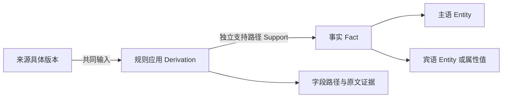

# SalesMate 可追溯业务知识图谱

2026-09-24 新增：全业务 schema 投影、不完整结构化观察、本机 Qwen 自然语言关联和邮件自动输入，详见 [自动建图说明](semantic-graph.md)。以下保留首版业务映射及历史验证说明；新增范围以该说明和当前 `graph/schema/` 接口为准。普通图谱 Worker 仍不调用模型，模型由独立输入链路调用。

首版已提供 PostgreSQL 图谱存储、事务变更捕获、自动维护 Worker、存量回填和只读 HTTP 接口。业务数据库保持权威，图谱是可重建的派生读模型。结构化数据按外键和状态映射；文本部分只复用已保存的 L1 抽取，没有新增 LLM 调用、训练或外部通信。

## 作用与工作场景

- 客户上下文：查询联系人、商机、订单、产品及客户陈述。
- 商机助手：获取带证据的需求、预算、交期候选，查看原始依据。
- 交叉销售输入：查询确认/履约订单支持的购买关系。查询仅返回购买证据，不包含产品推荐模型。
- 审计与纠错：追踪事实由哪些源记录的哪个版本产生，以及支持是否已撤销。

当前邮件陈述挂在客户公司，不自动猜测具体商机；商机产品名称保持属性，不擅自匹配 Product。待复核候选不代表已确认需求或成交概率。未实现聊天 Agent 自动调用、图形浏览页面、语义实体合并、任意多跳查询或外部图数据库。

## 模型



| 模型 | 职责 |
| --- | --- |
| `Entity` | owner、来源模型、主键确定稳定身份；名称只是标签 |
| `SourceVersion` | 白名单字段快照、内容指纹及版本；旧快照不覆盖 |
| `Fact` | 主语、谓词、宾语或属性值；区分 structured 与 extraction |
| `Derivation` | 版本化规则、全部输入版本及字段/原文证据 |
| `Support` | 事实与派生的支持边；多个订单可独立支持同一购买事实 |
| `Change` | 与业务写入同事务的事件，只保存归属、来源身份和操作类型 |
| `ProjectionState` | 是否构建过、最近成功时间和构建代次 |

一个派生的输入是 AND 依赖；同一事实的不同派生是 OR 支持。取消两张支持订单中的一张，只撤销一条路径；最后一条支持撤销后事实才成为 `unsupported`。

`active` 表示当前规则仍支持断言，不表示人工确认。`needs_review` 表示客户有多个不同的预算、数量或交期候选，需要结合时间及商机复核；不宣称它们必然矛盾，也不任意选取一个。`unsupported` 保留历史，不参与当前事实列表。

来源版本的 `current` 只表示它仍对应那条源记录的当前字段值；该来源是否仍被规则选用，要看派生的 `active`。例如旧抽取记录仍在数据库中，但已被新抽取替代，其历史支持路径不再有效。

来源版本是图谱实际使用过的快照。Worker 运行前的多次写入按当前一致快照合并处理：保留事件，但不伪造未用于推导的中间版本。`recorded_at` 是图谱记录时间，邮件 `observed_at` 是原邮件时间；本版不提供任意时点双时态查询。

## 来源与规则

迁移在以下十张表安装 INSERT/UPDATE/DELETE 行级捕获和 TRUNCATE 语句级捕获：

| 来源 | 投影 |
| --- | --- |
| `crm.Company` | 客户实体及归属 |
| `crm.Contact` | 联系人实体、`has_contact` |
| `crm.Mailbox` | 邮件权限和归属依赖；不读取凭证 |
| `crm.Email` | business 邮件实体、`has_email`、分类及复核版本 |
| `crm.Extraction` | 最新抽取的指定事实组，作为来源版本 |
| `sales.CompanySettings` | 公司归档/恢复依赖 |
| `sales.Product` | 产品实体、`catalog_price` |
| `sales.Opportunity` | 商机实体、`has_opportunity`、`stage`、金额、产品名称 |
| `sales.SalesOrder` | 订单实体、`has_order`、`order_status` |
| `sales.OrderLine` | 明细实体、`has_line`、`ordered_product`、数量、购买支持 |

`purchased` 只来自非归档 confirmed/fulfilled 订单及有效明细、产品、公司。draft/cancelled、邮件提及或商机 won 不生成购买关系。数量保留在各明细实体，不错误合并到共享购买边。

文本仅处理入站业务邮件最新且 completed 的抽取中的 `product_need`、`quantity`、`budget`、`delivery_time`、`decision_process`、`concerns`，生成 `reported_*` 属性。引用必须能定位到主题或正文。最新抽取失败时不回退旧抽取；已存输入格式错误或证据无法定位时构建明确失败，不静默跳过或补造证据。

完整正文不复制到图谱：版本保存正文哈希，派生保存实际引用片段。抽取事实和引用仍属于用户业务数据。

## 自动维护与一致性

1. 触发器与业务写入同事务记录事件，覆盖网页、Agent、批量 ORM、导入和普通直接 SQL。业务回滚时事件回滚；捕获失败也会使该业务事务失败。
2. Worker 按 pending 状态扫描，合并同一 owner 的事件。首版增量定位到所有者，再重算该所有者的完整投影；尚非单边增量优化。
3. 构建使用 PostgreSQL REPEATABLE READ、用户级非阻塞 advisory lock，并复用账号共享锁协调账号清空。
4. 来源版本、当前实体/事实/支持和本轮事件完成标记同事务提交。中途新提交的事件仍为 pending，不使用最大事件 ID 作为提交游标。
5. 查询使用一致快照；有 pending/failed 或未回填时，数据接口返回 503。状态接口可以说明原因，不拿旧图冒充当前结果。

失败回滚整次构建并保存 failed 事件，Worker 明确退出；失败用户不被普通调度自动重试。检查原因并修复后，须显式恢复。源更新只重算图谱，不调用 L1/L3/L4 或训练模型。映射语义改变时需推进 `MAPPING_VERSION` 并经测试后显式回填。

## 权限与删除

查询只按当前认证 owner 隔离，首版不开放团队共享或任意 owner 参数。沿用 SalesMate 身份认证；即使实验模式提供公开身份，图谱也只查询该身份自己的数据。同名公司、产品或跨账号记录不自动合并。

源归档/删除撤销当前支持；已发布过的版本和证据仍供原所有者审计。账号清空会删除图谱历史、M2M 输入边及该次清空产生的事件；账号删除级联清除其图谱。

缺少或禁用捕获触发器时接口拒绝读取当前图。曾禁用捕获再恢复后，必须显式全量回填补齐遗漏。新增来源表需要新的捕获迁移、字段映射、权限与测试，不自动猜测表语义。

## 安装与运行

从 SalesMate 根目录执行，使用现有 PostgreSQL 配置：

```powershell
.venv/Scripts/python.exe backend/manage.py migrate knowledge_graph --noinput
# 首次迁移已为现有用户排队，单轮处理不调用 LLM。
.venv/Scripts/python.exe backend/manage.py graph_worker --once
# 持续维护，默认检查间隔 2 秒；SIGTERM 后完成当前事务再停止。
.venv/Scripts/python.exe backend/manage.py graph_worker
```

`start-local.ps1` / `start-local.sh` 的 PostgreSQL 模式已纳入 `graph_worker`，随项目启动和停止。本次执行单轮回填，没有启动整套原有业务 Worker，避免顺带处理先前排队的邮箱、聊天或外发任务。远程服务器尚未部署，需另行配置 Worker 服务。

SQLite 预览保留原服务；图谱只建表、不安装捕获，API/维护命令明确拒绝，不切换其他实现。

```powershell
# 显式回填；必须选择范围。
.venv/Scripts/python.exe backend/manage.py graph_sync --owner 1
.venv/Scripts/python.exe backend/manage.py graph_sync --all
# 检查失败原因并修复后，显式恢复：
.venv/Scripts/python.exe backend/manage.py graph_sync --owner 1 --retry-failed
```

锁忙时同步命令返回 queued，事件保持 pending，不伪报完成。轮询间隔不是端到端时延保证；按用户全量重算的性能需要结合业务规模评估。

## 查询接口

| GET 接口 | 参数与输出 |
| --- | --- |
| `/api/v1/graph/status/` | ready/current、代次、最近成功时间、本人 pending/failed 数量 |
| `/api/v1/graph/entities/` | kind、q、page、page_size；稳定实体 ID、来源主键、标签 |
| `/api/v1/graph/facts/` | entity UUID 匹配入边/出边，predicate 过滤关系；当前事实及待复核候选 |
| `/api/v1/graph/facts/{fact_id}/lineage/` | 事实及分页的历史支持路径、输入版本、字段和原文证据 |

列表默认 30 条，page_size 最大 100。未认证 403，越权事实 404，非法输入 400，未同步或捕获不可用 503。错误沿用 `error` / `request_id`。OpenAPI 在 `/api/schema/`。

在已登录页面控制台调用：

```javascript
const status = await fetch('/api/v1/graph/status/').then(r => r.json());
console.log(status);
const purchases = await fetch('/api/v1/graph/facts/?predicate=purchased').then(r => r.json());
console.log(purchases);
// 使用返回的 fact_id：
// fetch(`/api/v1/graph/facts/${fact_id}/lineage/`).then(r => r.json());
```

后台可调用 `apps.knowledge_graph.sync.sync_owner(owner_id)` 消费事件，必须位于调用方事务之外。回填先显式 `request_sync(owner_id)`。查询调用方不能绕过接口直接读 Fact 而忽略同步状态。

## 验证与交付边界

2026-09-24：14 项图谱真实 PostgreSQL 测试，加上账号清空、既有邮件血缘及当时推荐接口回归，共 50 项通过（历史记录；旧推荐接口现已退役）。启动器测试 12 项中 10 项通过，2 项平台相关测试跳过，不代表 macOS/Bash 全平台实机验证。

测试覆盖捕获与回滚、多订单支持、版本与幂等、归档恢复、复核撤销、最新失败抽取、预算候选、证据失败与显式恢复、硬删除和邮箱级联、归属转移、权限与新鲜度、并发新提交、TRUNCATE、捕获缺失、图谱锁和账号清空。

测试使用专用 `test_salesmate_kg_20260924` 数据库，预装项目已有 pgvector 依赖，不提升业务账号权限。首次本地回填两个账号生成 148 个有效实体、165 条当前事实；数量随业务变化，不是固定阈值。236 个后端 Python 文件通过文档结构与变更检查，人工核对了本轮说明与实现；迁移一致性及 Django 检查通过。以上是首版历史验证，当时未提交Git或验证远程部署。本次发布的接口、MCP、服务器状态和检查结果见[使用与部署](semantic-graph-deployment.md)及[本次验证记录](semantic-release-verification.json)；仍未验证生产压力或推荐效果。
