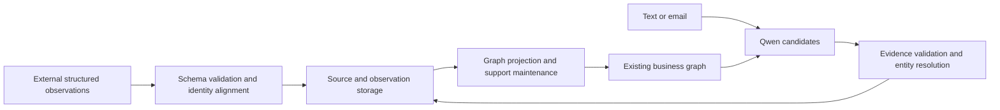

# Graph model: inputs, outputs, use cases, fine-tuning, and quantization

This page records experimental conditions/conclusions at the time. Old weights were subsequently removed at the user's request on 2026-09-25; see [retirement/recovery](model-retirement.md) for retained artifacts. Historical default-model statements below do not describe current deployment.

Models convert text into constrained entity/relation candidates; databases, entity resolution, and graph maintenance persist/update them. Weights do not store live customer graphs or automatically train on each email.

## Actual model input

semantic_contract.messages() produces two messages: system instructions cover extraction, source excerpts, negation, and schema constraints; user contains JSON like this. The example omits most fields; actual input includes 48 controlled business schemas.

```json
{
  "observed_at": "2026-09-24T12:00:00+00:00",
  "existing_context": {
    "schema": {"crm.company": {"name": "CharField"}, "sales.product": {"name": "CharField"}},
    "entities": [
      {"id": "11111111-1111-4111-8111-111111111111", "kind": "crm.company", "label": "Acme", "fields": {"name": "Acme"}},
      {"id": "22222222-2222-4222-8222-222222222222", "kind": "sales.product", "label": "Edge", "fields": {"name": "Edge"}}
    ],
    "facts": [],
    "generation": 1
  },
  "new_text": "Acme 需要 Edge，预算为 800 SGD。"
}
```

Context is user-scoped, containing candidate labels, identity fields, and observations without credentials. Email input is subject + newline + plain-text body; attachments are not parsed in this experiment. Occurrence times do not authorize overwriting old facts.

## Model output

Output has entities/facts arrays, not SQL or executable business actions:

```json
{
  "entities": [
    {"key": "e1", "name": "Acme", "kind": "crm.company", "existing_id": "11111111-1111-4111-8111-111111111111", "quote": "Acme"},
    {"key": "e2", "name": "Edge", "kind": "sales.product", "existing_id": "22222222-2222-4222-8222-222222222222", "quote": "Edge"}
  ],
  "facts": [
    {"subject": "e1", "predicate": "needs_product", "object": "e2", "value": null, "quote": "Acme 需要 Edge"},
    {"subject": "e1", "predicate": "reported_budget", "object": null, "value": "800 SGD", "quote": "预算为 800 SGD"}
  ]
}
```

existing_id proposes candidate reuse; new entities use null. Relation objects use local entity keys; property values preserve source literals. Missing quantities, delivery dates, and transaction states are not filled. Programs validate, resolve identity, and maintain support while retaining raw output and decisions separately. Existing excerpts do not prove semantic correctness.



## Supported scenarios

| Scenario | Current role | Boundary |
|---|---|---|
| Inbound business email | Link companies/contacts/products and organize needs/budgets/delivery observations | Existing email tables, explicit watcher startup, no attachment parsing |
| Follow-ups/meeting notes | Reuse entities and add relations/fields | Name matching may mislink |
| Incomplete CRM imports | Partial records across 48 schemas, placeholders for missing foreign keys | No LLM needed; no formal order creation |
| Conflicting sources | Preserve values/evidence as review candidates | No automatic determination of which is correct |
| Company evidence queries | Existing entity/fact/lineage APIs | Automatic general-chat calls/graphical pages excluded |
| Quotes/orders/permissions | External text becomes observations | No autonomous transaction confirmation, sending, or permission changes |

## Quantization effects

Quantization primarily reduces size/weight-read costs and may accelerate inference depending on hardware, kernels, and context. The existing local model was already Q4_K_M; earlier 90–98-second Chinese graph inputs were not F16 baselines.

A 2026-09-24 microbenchmark used the same Ryzen 7 7745HX, official llama.cpp b11146, 8 CPU threads, 0 GPU layers, 128 input/32 generated tokens, three repeats each, and default warmup.

| Metric | Original F16 | Original Q4_K_M | Q4/F16 |
|---|---:|---:|---:|
| Input tokens/s | 92.44 | 122.58 | 1.33× |
| Generation tokens/s | 5.21 | 12.89 | 2.47× |
| Artifact GiB | 7.498 | 2.326 | About 31% |

The benchmark excludes tokenization/sampling; generation is not measured under 4000-token business context. Desktop load, ordering, and cache were not strictly isolated, so full-email latency cannot be claimed to fall to 1/2.47. Q4 may not accelerate every GPU stage. See official [llama-bench](https://github.com/ggml-org/llama.cpp/tree/master/tools/llama-bench).

Another preregistered long-context test completed on 2026-09-25: 4096 input + 256 output tokens, same machine/8 CPU threads/three repeats. F16 averaged 169.99 seconds, Q4 106.30, about 1.60× faster/37.5% less computation time. This better approximates full business-schema context but still excludes tokenization, sampling, and API overhead. Raw results: local-context-*-bench.json in experiment outputs.

## Is fine-tuning required?

Structured ingestion/maintenance needs no fine-tuning. Natural language can begin with official weights; observed contact/employment confusion and omitted existing IDs justify labeled experiments assessing improvements.

Train schema extraction, abstention, evidence citation, and ID selection—not changing customer facts as long-term memory. Good positive/negative examples and independent evaluation matter more than additional steps. Small-data fine-tuning may overfit or damage existing capabilities.

This experiment uses QLoRA: freeze a 4-bit base, train small LoRA adapters, merge into original FP16, convert GGUF, then quantize Q4. Training NF4 and deployment Q4_K_M differ. See [PEFT quantization](https://huggingface.co/docs/peft/developer_guides/quantization) and [LoRA](https://huggingface.co/docs/peft/package_reference/lora).

The initial private Kaggle experiment used 96 synthetic training, 12 development, and 12 test cases, with disjoint identities/shared templates and 24 fixed updates. Compare original F16/Q4 and fine-tuned F16/Q4, reporting raw-model versus post-resolution results separately. This cannot establish real-email accuracy or automatically replace deployments.

On 2026-09-25, [private V2 Kaggle](https://www.kaggle.com/code/heropig/salesmate-semantic-qlora-v2) completed training/merging/quantization; downloaded weights were verified. It trained 5,898,240 LoRA parameters for 24 updates on 96 synthetic examples in about 16.8 minutes. Independent recomputation of all 48 raw responses yielded:

| Weights | Valid structure/evidence | Exact facts | Fact micro-F1 |
|---|---:|---:|---:|
| Original F16 | 11/12 | 4/12 | 0.483 |
| Original Q4 | 8/12 | 3/12 | 0.417 |
| Fine-tuned F16 | 11/12 | 8/12 | 0.667 |
| Fine-tuned Q4 | 8/12 | 6/12 | 0.444 |

**Some improvements occurred, but this version was not recommended for directly replacing defaults.** Fine-tuned models still infer works_for from contacts without established employment; Q4 also reverses product-need direction. Better zero-fact cases increase exact matches while positive-fact TP falls from 5 to 4, so pass counts alone are insufficient. Review graph facts/relations against source text.

Mean GPU request times were 8.78, 5.76, 8.01, and 6.05 seconds respectively; differing output lengths prevent throughput equivalence. Fixed-length CPU benchmarks showed little same-precision speed change after fine-tuning. Fine-tuning primarily changes behavior; quantization primarily changes size/cost. Existing systems already used Q4, so F16→Q4 acceleration cannot be counted twice.

Complete I/O, per-case failures, hashes, and checks reside in workspace output/semantic-finetune-v2-20260925/REPORT.md and verification/verification.json. Quantized weights were in results/semantic-ft-v2/Qwen3-4B-SalesMate-Semantic-v2-Q4_K_M.gguf, with adapter/ alongside. Only synthetic text/schema metadata was used; no real emails/business rows were uploaded and defaults were not replaced during this experiment.

Fine-tuned Q4 also loaded under existing local llama.cpp and completed short benchmarks: 8 CPU threads, 128 input/32 generated tokens, three repeats, 95.30 input tokens/s and 14.18 generation tokens/s. This validates artifact executability, not real-email accuracy. Load/time differences prevent attributing speed changes to fine-tuning itself.

History: [V1](https://www.kaggle.com/code/heropig/salesmate-semantic-qlora-v1) OOMed on first backpropagation and produced no trained weights. The user approved explicit KV expansion + memory-efficient SDPA in V2, retaining other training/evaluation conditions. Real T4 small-tensor forward/gradient and complete 4324-token prechecks passed; training peaked around 6.22 GiB VRAM. Old failures remain in output/semantic-finetune-20260924/ and were not mixed into V2 best-result selection.
