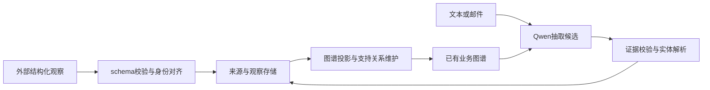

# 图谱模型：输入输出、适用场景与微调量化实验

模型的工作是把文本变成受约束的实体和关系候选；数据库、实体解析及图谱维护程序负责保存和更新。模型权重不存放实时客户图谱，不会随着每封邮件自动训练。

## 模型实际收到什么

`semantic_contract.messages()` 生成两条消息：system 包含抽取、原文引用、否定处理及 schema 约束；user 是下面这种 JSON。示例省略大部分字段，真实版本包含48类受控业务 schema。

```json
{
  "observed_at": "2026-09-24T12:00:00+00:00",
  "existing_context": {
    "schema": {"crm.company": {"name": "CharField"}, "sales.product": {"name": "CharField"}},
    "entities": [
      {"id": "11111111-1111-4111-8111-111111111111", "kind": "crm.company", "label": "Acme", "fields": {"name": "Acme"}},
      {"id": "22222222-2222-4222-8222-222222222222", "kind": "sales.product", "label": "Edge", "fields": {"name": "Edge"}}
    ],
    "facts": [],
    "generation": 1
  },
  "new_text": "Acme 需要 Edge，预算为 800 SGD。"
}
```

上下文限于当前用户，包含候选标签、身份字段及已有观察事实，不包含账号凭据。邮件使用“主题＋换行＋纯文本正文”，本轮尚不解析附件。发生时间不代表模型可以自行覆盖旧事实。

## 模型返回什么

输出是 `entities`、`facts` 两个数组，而不是 SQL 或直接执行的业务动作。例如：

```json
{
  "entities": [
    {"key": "e1", "name": "Acme", "kind": "crm.company", "existing_id": "11111111-1111-4111-8111-111111111111", "quote": "Acme"},
    {"key": "e2", "name": "Edge", "kind": "sales.product", "existing_id": "22222222-2222-4222-8222-222222222222", "quote": "Edge"}
  ],
  "facts": [
    {"subject": "e1", "predicate": "needs_product", "object": "e2", "value": null, "quote": "Acme 需要 Edge"},
    {"subject": "e1", "predicate": "reported_budget", "object": null, "value": "800 SGD", "quote": "预算为 800 SGD"}
  ]
}
```

`existing_id` 是候选复用建议；新实体为 null。关系的 object 使用局部实体键；属性的 value 保留原文字面值。没有给出的数量、交期、成交状态不会自动补齐。程序随后校验、解析身份和维护支持关系；既保留原模型输出，也保留解析决定。引句存在并不证明关系含义正确。



## 本系统可用场景

| 场景 | 当前作用 | 边界 |
|---|---|---|
| 入站业务邮件 | 关联客户、联系人、产品；整理需求、预算、交期观察 | 使用已有邮件表，需启动监听命令；无附件解析 |
| 销售跟进和会议纪要 | 后续输入复用已有实体，补充关系和字段 | 姓名匹配仍可能误关联 |
| 不完整CRM导入 | 按48类schema接收部分记录，缺失外键先占位 | 结构化分支不需要LLM，不会创建正式订单 |
| 多来源冲突追踪 | 保存不同预算等属性及证据，显示待复核 | 不自动判断新旧哪条正确 |
| 客户证据查询 | 经现有图谱API查实体、事实、来源路径 | 通用聊天自动调用与图形页面未在本轮接入 |
| 报价、订单及权限操作 | 外部文本可保存为观察 | 不授权LLM自动确认成交、发信、改权限 |

## 量化能带来什么

量化主要减少模型体积和权重读取成本，有可能加快推理，实际取决于硬件、算子与上下文长度。原有本机模型已经是Q4_K_M；此前90–98秒的中文图谱输入不是F16基准。

2026-09-24在同一台Ryzen 7 7745HX、官方llama.cpp b11146、CPU8线程、GPU0层下进行新微基准：128输入tokens、32生成tokens、各3次、默认预热。

| 指标 | 原版F16 | 原版Q4_K_M | Q4/F16 |
|---|---:|---:|---:|
| 输入处理tokens/s | 92.44 | 122.58 | 1.33倍 |
| 生成tokens/s | 5.21 | 12.89 | 2.47倍 |
| 制品体积GiB | 7.498 | 2.326 | 约31% |

微基准不包含分词和采样开销；生成测试不是在4000tokens业务上下文下运行。桌面负载、运行顺序和缓存未做严格隔离，不可直接声称完整邮件延迟降低为1/2.47。GPU上Q4也不一定每一阶段更快。官方工具说明：[llama-bench](https://github.com/ggml-org/llama.cpp/tree/master/tools/llama-bench)。

2026-09-25完成另一组预先登记的长上下文测试：4096输入＋256生成tokens，仍是同机CPU8线程、各3次。F16平均169.99秒，Q4平均106.30秒，约快1.60倍、计算耗时减少37.5%。这更接近完整业务schema的上下文长度，但不包含分词、采样及业务接口开销。原始结果在实验目录的`local-context-*-bench.json`。

## 是否需要微调

结构化入图和图谱维护不需要微调。自然语言分支可以先使用官方权重；本项目已发现联系人/任职混淆、已有实体ID遗漏等问题，因此适合用标注样例验证微调是否改善。

应训练“如何按schema抽取、何时不推断、如何引用证据、怎样选实体ID”，不要把不断变化的客户事实当成长期模型记忆。高质量正反例和独立评估比单纯增加训练步数更重要；小数据微调也可能过拟合或损害原有能力。

本次方法是QLoRA：冻结4-bit基座并训练小型LoRA适配器；随后将适配器合并回原始FP16权重，再转GGUF、量化Q4。训练阶段NF4与部署阶段Q4_K_M是不同量化方案。说明：[PEFT量化训练](https://huggingface.co/docs/peft/developer_guides/quantization)、[LoRA](https://huggingface.co/docs/peft/package_reference/lora)。

首轮私有Kaggle实验使用96条合成训练、12条开发、12条测试，身份不重叠但模板共享；固定24次更新。对照原版F16、原版Q4、微调F16、微调Q4。必须分别报告模型本身和程序解析后的效果；这轮不能代表真实邮件准确率，也不会自动替换部署模型。

2026-09-25，[V2私有Kaggle实验](https://www.kaggle.com/code/heropig/salesmate-semantic-qlora-v2)已完成微调、合并和量化，权重已下载并核验。5898240个LoRA参数、24次更新、96条合成训练，正式训练约16.8分钟。独立复算全部48份原始响应得到：

| 权重 | 结构/证据合法 | 事实完全匹配 | 事实micro F1 |
|---|---:|---:|---:|
| 原版F16 | 11/12 | 4/12 | 0.483 |
| 原版Q4 | 8/12 | 3/12 | 0.417 |
| 微调F16 | 11/12 | 8/12 | 0.667 |
| 微调Q4 | 8/12 | 6/12 | 0.444 |

**有局部改善，但这版不建议直接替换默认模型。** 微调模型仍误把“联系人但未说明雇佣关系”输出为`works_for`；Q4又出现产品需求方向颠倒等问题。Q4的零事实样本改善使整题匹配数增加，但正向事实TP从5降至4，不能只看通过题数。图谱中的事实和关系仍需结合原文复核。

四组平均GPU请求时间依次8.78、5.76、8.01、6.05秒，生成长度不同，不能等同计算吞吐。固定长度CPU微基准中，同精度微调前后速度基本不变。微调主要改变抽取行为，量化才主要改变体积与执行成本；当前默认系统已有Q4，不能将F16→Q4的加速重复计算。

完整输入输出、逐题失败、权重哈希及核验结果在工作区`output/semantic-finetune-v2-20260925/REPORT.md`和`verification/verification.json`；量化权重位于`results/semantic-ft-v2/Qwen3-4B-SalesMate-Semantic-v2-Q4_K_M.gguf`，LoRA位于同目录`adapter/`。本轮只用了合成文本和schema元数据，没有上传真实邮件或业务行，未替换默认部署。

微调Q4也已在本机现有llama.cpp上完成加载和短微基准：CPU8线程，128输入/32生成、各3次，输入95.30tokens/s、生成14.18tokens/s。此项验证制品可运行，不代表真实邮件准确率；桌面负载和测试时间差也使其不能用于断言微调本身加速。

执行历史：[V1](https://www.kaggle.com/code/heropig/salesmate-semantic-qlora-v1)首次反向传播OOM，没有训练权重；用户批准V2显式KV展开＋memory-efficient SDPA，其他训练/评测条件不变。真实T4的小张量前向/梯度和完整4324-token样本预检通过，正式训练峰值显存约6.22GiB。旧失败记录保留在`output/semantic-finetune-20260924/`，未混入V2挑选最优结果。
